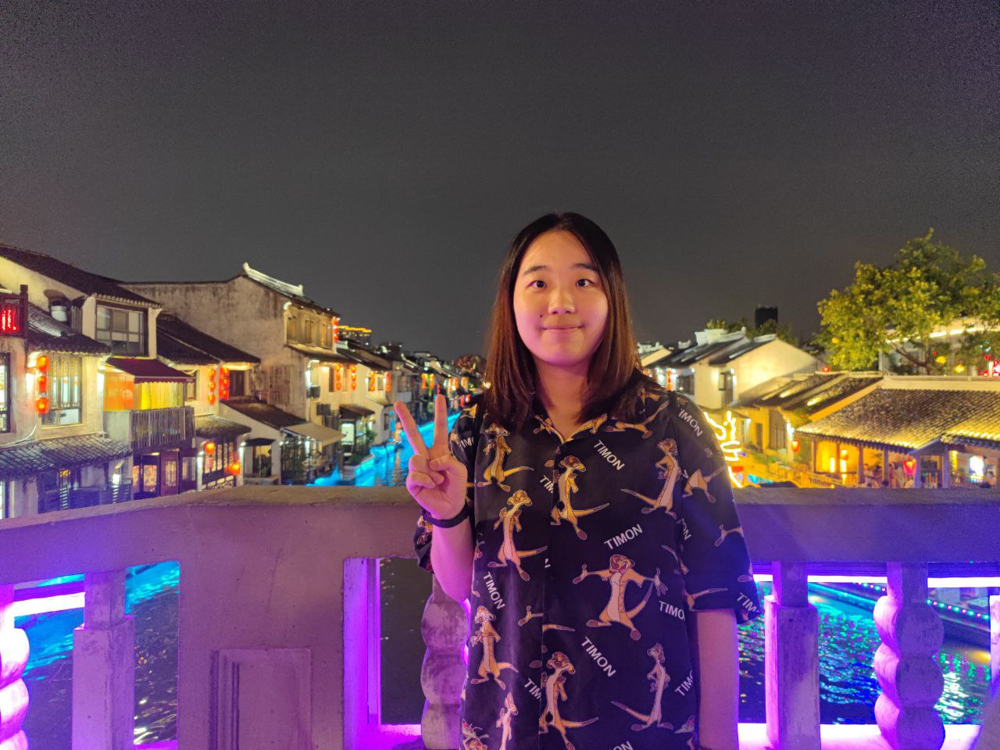
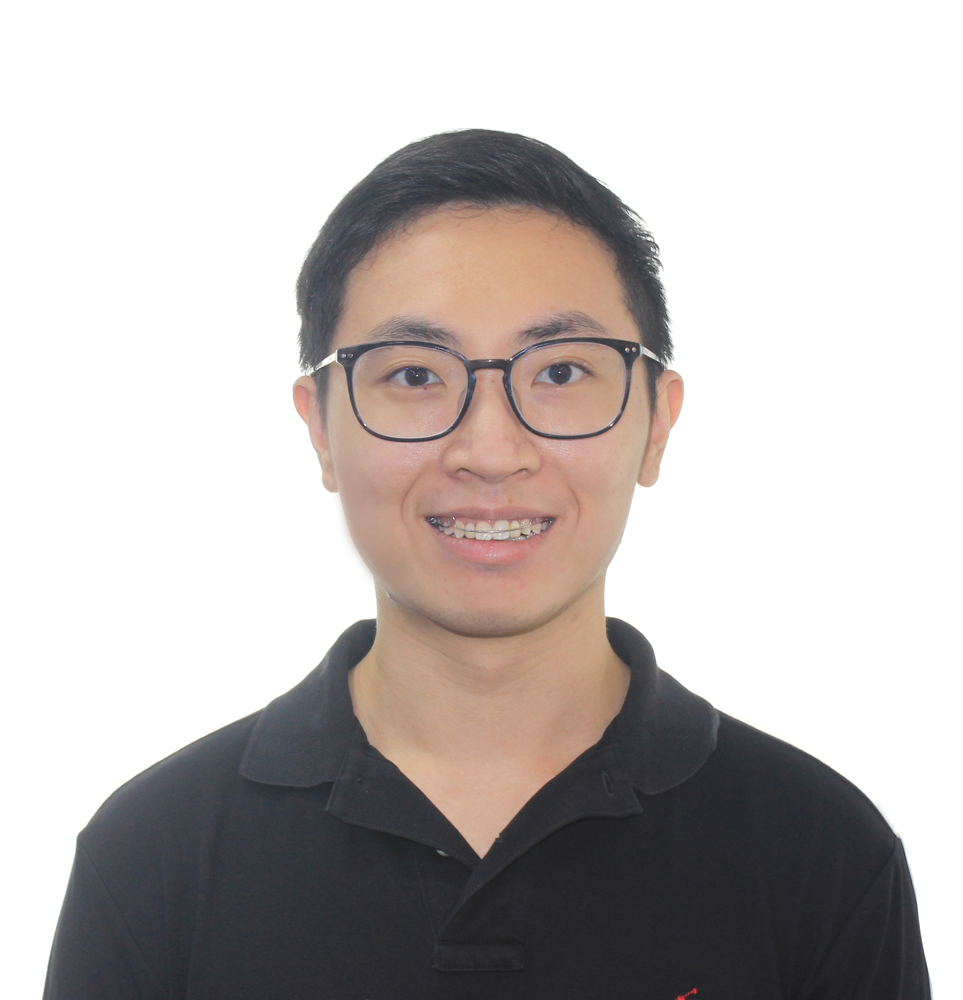
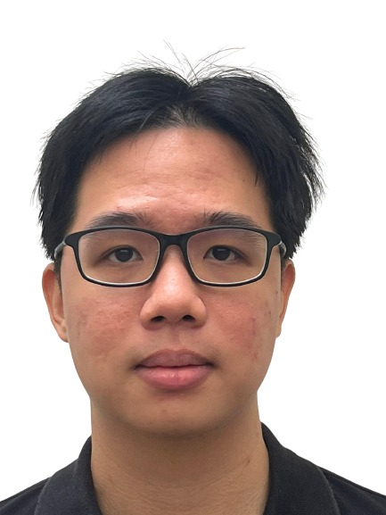
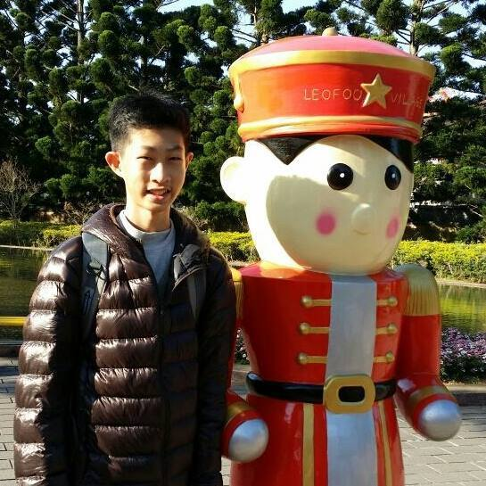

# About Us

We are a team based in the [School of Computing, National University of Singapore](http://www.comp.nus.edu.sg).

You can reach us at the email 
 - `mary84060117[at]gmail.com`
 - `Ivan's email`
 - `weihong.ong[at]u.nus.edu.sg`
 - `nancyqinilm[at]gmail.com`
 - `ryanozx[at]u.nus.edu.sg` 

## Project team

### Chen Qun

[[github](https://github.com/jean-cq)]
[[portfolio](team/jean-cq.md)]

* Role: Developer, Deliverables and deadlines
* Responsibilities: Ensure project deliverables are done on time and in the right format.
### Ivan Tan

[[github](http://github.com/ivyy-poison)]
[[portfolio](team/ivyy-poison.md)]

* Role: Developer, Integration
* Responsibilities: In charge of versioning of the code, maintaining the code repository, integrating various parts of the software to create a whole.

### Ong Wei Hong

[[github](http://github.com/ong-wei-hong)] [[portfolio](team/ong-wei-hong.md)]

* Role: Developer, Code Quality
* Responsibilities: Looks after code quality, ensures adherence to coding standards, etc.

### Qin Nanxin

[[github](http://github.com/infibeyond)]
[[portfolio](team/infibeyond.md)]

* Role: Developer, Documentation
* Responsibilities: Ensures the quality of various project documents.

### Ryan Ong

[[github](http://github.com/ryanozx)]
[[portfolio](team/ryanozx.md)]

* Role: Developer, Testing
* Responsibilities: Ensures the testing of the project is done properly and on time.
