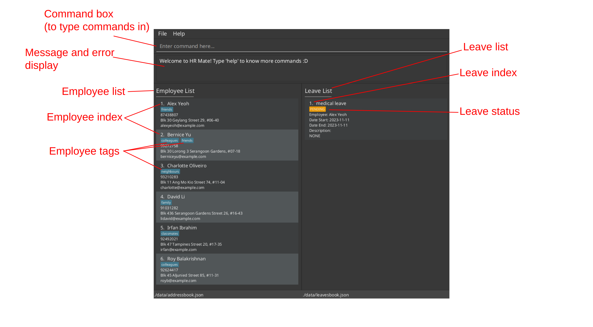
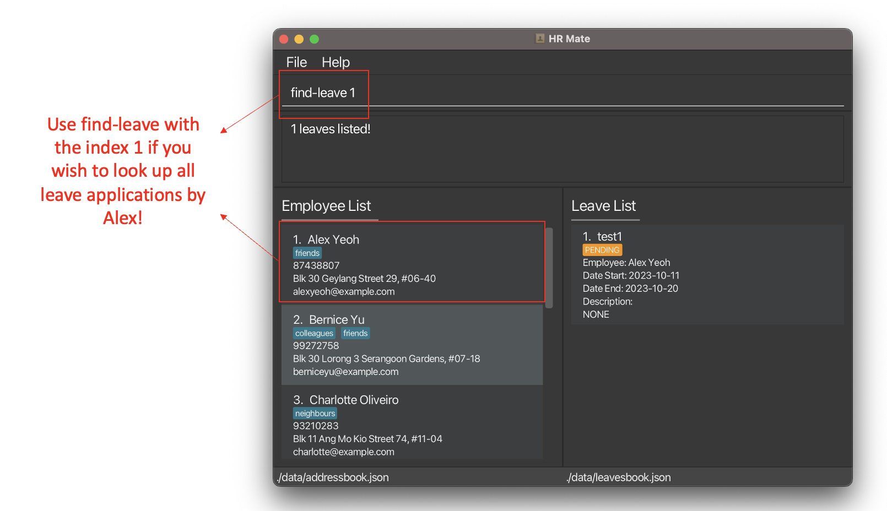
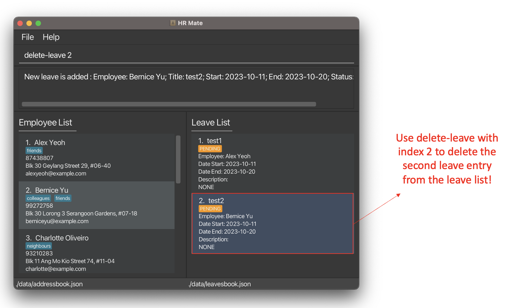

<frontmatter>
  layout: default.md
  pageNav: 3
  title: "User Guide"
</frontmatter>

# HRMate User Guide

Welcome to HRMate, the go-to desktop application designed exclusively for HR managers like yourself. 

Discover a seamless one-stop solution within HRMate to oversee your team's contact details, 
roles, and streamline leave application processes, so you can keep both your staff and management 
satisfied.

If you are a fast typist, you will love the swift speed of working in HRMate compared to traditional HR apps like 
Oracle and SAP. HRMate's [Command Line Interface (CLI)](#glossary) is optimised for you, so you can perform nearly 
every task simply by typing short commands ([What is a command?](#glossary)).

This guide explains how you can set up and use the various features of HRMate, as well as provides
troubleshooting insights to help solve problems you might face while using HRMate. No matter your familiarity with 
HRMate or technology, this guide has something for you.

**New to HRMate?** Dive into our [Quick Start](#quick-start) guide for a step-by-step setup and key features tutorial, 
so you can start using HRMate in no time.

**Need a quick refresher on the commands?** Explore the [Command Summary](#command-summary), a concise compilation
of commands and their usage.

**Seasoned HRMate user?** Delve into our [Features](#features) section for an in-depth exploration of advanced features
to elevate your HR management experience.

We trust you will find this guide helpful in maximising your HRMate experience!

~ _The HRMate team_

<!-- * Table of Contents -->
<page-nav-print></page-nav-print>

--------------------------------------------------------------------------------------------------------------------

## About HRMate

At its core, HRMate is a desktop application designed to help HR managers manage their employees' contact details and
leave applications.

#### Employee

HRMate stores your employees' contact details, such as their name, phone number, email address, and home address in an [employee list](#glossary). 
In addition, HRMate also allows you to [tag](#glossary) your employees and categorise them into groups for easier management. You could categorise them by their roles, such as "Full-time" or "Part-time", or by their departments, such as "Sales" or "Marketing", whichever suits your needs and preferences best.

#### Leave Applications

HRMate also allows you to manage your employees' leave applications in a [leave list](#glossary). You can add, approve, and reject leave applications, as well
as view all leave applications at a glance. You can also filter leave applications by their status, such as "PENDING" or "APPROVED",
to help you keep track of the status of each leave application.

Each leave application is associated with an employee by name and has a title, description, start date, and end date.

 

To facilitate ease of transfer of information, a core feature of HRMate is its ability to import and export employee records and
leave applications in [CSV](#glossary) format. This allows you to easily transfer your employee records and leave applications to and from
HRMate, so you can use HRMate alongside other HR management tools.

## Quick start

1. Download the latest `hrmate.jar` from [to be updated]() and move the downloaded file to your desired location. 
See [How do I move a file?](#q-how-do-i-move-a-file) for help.

2. Open a terminal or your computer.
<box type="info" seamless>
    <ul>
        <li><strong>For Mac users:</strong> open the Terminal app on your Mac</li>
        <li><strong>For Window users:</strong> press the windows key, type `powershell` and press "Enter" on your keyboard</li>
        <li><strong>See <a href="#faq">How do I open a terminal?</a> for more information.</li>
    </ul>
</box>

3. Use `cd` command in the terminal to navigate to the same location as `hrmate.jar` in step 1. See [How do I navigate files in terminal?](#faq)

4. Ensure you have `Java 11` or above installed on your Computer. This can be done by typing `java -version` in your terminal and pressing "Enter".
 - See <a href="#faq">How do I download Java 11?</a> if Java is not updated or if the terminal does not recognise the `java` input. 

5. Type `java -jar hrmate.jar` into the terminal and press "Enter" on your keyboard. 
An app similar to the one below should appear in a few seconds. The app is populated with some sample data for you to experiment with. 
We have added some annotations in red so that you can understand the app visually.

6. You can try typing some commands into the command box and pressing "enter" to execute. We have listed down some commands for you to try.  
 - `help`: Opens the help window.
 - `add n/John Doe p/98765432 e/johnd@example.com a/John street, block 123, #01-01`: Adds an employee named `John Doe` to the employee list.
 - `list`: Lists all employees.
 - `add-leave 1 title/medical leave start/2023-11-11 end/2023-11-11`: Adds a leave entry for the first employee in the current employee list. Note that the default leave status is `PENDING`.
 - `delete 2`: Deletes the second employee shown in the current employee list and any leave applications associated with the second employee.
 - `exit`: Exits the app.
For new users, especially first-time users, it is very important and helpful to read through the [How to interpret command formats?](#how-to-interpret-command-formats). This section provides a detailed introduction to the overall structure of all commands used in HRmate.

Also, look through [Features](#features) for commands and the details of each command. If you would like a concise summary of the commands, please check out our [command summary](#command-summary). We hope to aid you in your HR journey!

--------------------------------------------------------------------------------------------------------------------
## Important things to note
> [!WARNING]  
> HRmate is coded to take in the exact commands stated in this user guide. Please do not change the spelling, remove or add symbols, adjust spaces, or change the letter case of the commands. Any changes to the commands, unless otherwise stated in this user guide, can lead to the program being unable to interpret the input. To ensure the best user experience, please follow the commands exactly as instructed in this user guide.
>
> - For a more detailed introduction to the command structure of HRmate and specific information on the parts of a command we can and cannot modify, please refer to [How to interpret command formats?](#how-to-interpret-command-formats).
>   
> - Read through our [features](#features) section for detailed information on each command.
>
> - Check out our [command summary](#command-summary) for a concise list of available commands and their formats.

#### Character Limit
> [!IMPORTANT]
> Currently, HRmate's user interface is able to hold 35 to 160 characters on a single line, depending on the letters used. For any inputs longer than the character limit, HRmate will display `...` for the remaining characters after the character limit.

#### Index
> [!IMPORTANT]
> HRmate's lists are indexed from 1 onwards. Anything else apart from positive integers (1, 2, 3, ...) isn't accepted as an index in HRmate. This means that numbers such as 0, -1, 1.2 and characters like "a" and "one" cannot be used as indexes. This is particularly important for index-specific commands (i.e. `edit`, `approve-leave`, etc.) as they require a valid index to function properly. Please also note that the indexes are limited to the number of employees or leaves shown in the current list in HRmate. Inputting an index larger than the currently available index can result in error messages and the command is unable to function correctly.

#### Name
> [!IMPORTANT]
> HRmate's names are case-sensitive. This means that the names `Alex` and `alex` are interpreted as different names.

#### Tag
> [!IMPORTANT]
> HRmate's tags are case-sensitive. This means that tags `Part-Time` and `part-time` are interpreted as different tags. Having redundant tags with similar spelling may decrease efficiency and add unnecessary workload. To see all current tags in use, you may refer to the `view-tag` command. Please make note of this while interacting with tag-related commands like `add-tag`.

#### Command Order
> [!IMPORTANT]
> Please note that you are unable to edit employees or leave applications when the respective list is empty. Please start by adding some employees or leave applications before attempting to edit them.

#### PDF Version Copy and Paste
> [!IMPORTANT]
> If you are using a PDF version of this document, please be careful when copying and pasting commands that span multiple lines as space characters surrounding line breaks may be omitted when copied over to the application.
--------------------------------------------------------------------------------------------------------------------

## Features

## Employee-related features

###  Add an employee record
When a new employee joins, use the [`add`](#adding-an-employee-add) command to add their information into HRMate.

#### Adding an employee: `add`

Use the `add` command to add an employee to the employee list.

1. Type in the following command in the [command box](#glossary): `add n/NAME p/PHONE_NUMBER e/EMAIL_ADDRESS a/HOME_ADDRESS [t/TAG]...`, replace `NAME` with employee name, `PHONE_NUMBER` with employee phone number `EMAIL_ADDRESS` with employee email address and `HOME_ADDRESS` with employee home address. `[t/TAG]...` is an optional field with one or more tags, with `TAG` being the name of the tag.
 - For instance, if you have an employee name John Doe with phone number 98765432, email johnd@example.com, home address John Street, block 123 #01-01 and tags full-time and remote, type in the command `add n/John Doe p/98765432 e/johnd@example.com a/John Street, block 123 #01-01 t/full-time t/remote`
 - If your employee does not require any tags, using the same information as above, the command would be `add n/John Doe p/98765432 e/johnd@example.com a/John Street, block 123 #01-01`
 - Please refer to [how to interpret command formats](#how-to-interpret-command-formats) for more information
2. Press "enter" on your keyboard and you should see the person information at the end of the employee list. 

Here are the potential error messages that you may receive and here's how to fix them:

| Error message                                                                                                                                          | Why it happens                                                                                                  | Fix                                                                                                                                                                                                                                                                                                                                                                                                              |
|--------------------------------------------------------------------------------------------------------------------------------------------------------|-----------------------------------------------------------------------------------------------------------------|------------------------------------------------------------------------------------------------------------------------------------------------------------------------------------------------------------------------------------------------------------------------------------------------------------------------------------------------------------------------------------------------------------------|
| `Invalid command format!`                                                                                                                              | The command you input does not follow the specified format                                                      | Ensure the command you entered follows the following format: `add n/NAME p/PHONE_NUMBER e/EMAIL_ADDRESS a/HOME_ADDRESS [t/TAG]...`, replacing `NAME` with employee name, `PHONE_NUMBER` with employee phone number, `EMAIL_ADDRESS` with employee email address, `HOME_ADDRESS` with employee home address. `[t/TAG]...` is optional, with `[t/TAG]` representing one or more tags and `TAG` being the tag name. |
| `FIELD should FORMAT` where `FIELD` is an input like `Names` or `Phone numbers` and `FORMAT` contains additional information about the field's format. | The input does not follow the format prescribed. For example, the entered phone number might contain alphabets. | Follow the on screen message to fix the field in question. For example, `Phone numbers should only contain numbers, and it should be at least 3 digits long` means that the input phone number does not follow the prescribed format.                                                                                                                                                                            |
| `This employee already exists in the address book`                                                                                                     | The provided employee name is already found in HRMate                                                           | Use another name for the employee. For example, if trying to add another "John Doe", use the name "John Doe (HR)" to differentiate between the existing John Doe. HRMate does this name checking to prevent unintentional duplicate employee entries.                                                                                                                                                            |

> [!IMPORTANT]
> Currently, HRmate's user interface is able to hold 35 to 160 characters on a single line, depending on the letters used. For any inputs longer than the character limit, HRmate will display ... for the remaining characters after the character limit.

> [!IMPORTANT]
> HRmate's names are case-sensitive. This means that the names `Alex` and `alex` are interpreted as different names. 

> [!IMPORTANT]
> HRmate's tags are case-sensitive. This means that tags `Part-Time` and `part-time` are interpreted as different tags. Having redundant tags with similar spelling may decrease efficiency and add unnecessary workload. To see all current tags in use, you may refer to the `view-tag` command.

### Find an employee record
HRMate makes it easy to find an employee and there are multiple ways of doing so. You can use the [`list`](#listing-all-employees-list) command to list all employees, or use the [`find`](#finding-employees-by-name-find) command to find employees by name. You can also use the [`find-all-tag`](#finding-employees-by-all-specified-tags-find-all-tag) and [`find-some-tag`](#finding-employees-by-at-least-one-specified-tag-find-some-tag) commands to find employees by their associated [tags](#glossary).

#### Listing all employees: `list`

Use the `list` command to view all employees that are currently listed in the employee list.

1. Type in the following command in the command box: `list`.
2. Press "enter" on your keyboard and you should see the information of all employees listed in the employee list.

> [!NOTE]  
> This command does not require any parameters. However, to account for possible typing mistakes, HRMate reads in inputs like `list 123`, `list abc`, and `list 1a2b` all as the command `list`.

Here are the potential error messages that you may receive and here's how to fix them:

| Error message | Why it happens | Fix |
|---------------|----------------|-----|
| `Unknown command` | The command you inputted is not part of the commands available in HRmate. | Please check the spelling and try again.

#### Finding employees by name: `find`

Use the `find` command to find employees by name. This command will find employees whose names contain the specified words that you enter.

  1. Type in the following command in the command box `find NAME....` where `NAME...` are to be replaced with one or more names of the employees for search.
     * The words for search are case insensitive, meaning you do not have to worry about the capitalization of the words entered. 
  - For instance, to find employees whose names contain `Martin`, type `find martin` to the command box.
  - Take another example, suppose we have employees `alex` and `Alex`, for input `find alex`, both employees will be shown as a reult.
  - For another instance, to find employees whose names contain either "*Harry*" or "*Redknapp*, type `find harry redknapp` to the command box.
  - However, if you want to find employees whose names contain `martin` but only entered `mar`, NO employee named Martin will be found, instead employee named Mar will be found. Note that he search looks for names containing the entire specified word.
  2.  Press "enter" on your keyboard and you should see the employees matched being listed in the employee list.
    
| Error message | Why it happens | Fix |
|---------------|----------------|-----|
| `Invalid command format!` | The command you input does not follow the specified format | Ensure the command you entered follows the following format: `find NAME...` where `NAME` is the specified name of the employee to search (case-insensitive).
                                                                                                                                                                                            
* **For advanced users:**
  * Employees are displayed in the order in which they are arranged in the employee list.

#### Viewing All Tags: `view-tag`

To view all tags currently in use within the employee list, use the `view-tag` command. This will be 
useful if you want to find employees by their associated tags using the [`find-all-tag`](#finding-employees-by-all-specified-tags-find-all-tag) and [`find-some-tag`](#finding-employees-by-at-least-one-specified-tag-find-some-tag) commands.

1. Type in the following command in the command box: `view-tag`.
2. Press "enter" on your keyboard and you should see a list of all tags currently in use within the employee list.

> [!NOTE]  
> This command does not require any parameters. However, to account for possible typing mistakes, HRMate reads in inputs like `view-tag 123`, `view-tag abc`, and `view-tag 1a2b` all as the command `view-tag`.

Here are the potential error messages that you may receive and here's how to fix them:

| Error message | Why it happens | Fix |
|---------------|----------------|-----|
| `Unknown command` | The command you inputted is not part of the commands available in HRmate. | Please check the spelling and try again.

#### Finding employees by all specified tags: `find-all-tag`

To find employees by a set of specified tags, use the `find-all-tag` command. This command will find employees that are currently associated with all the specified tags that you enter.

1. Type in the following command in the command box `find-all-tag t/TAG [t/MORE_TAGS]...` where `TAG` is to be replaced with the name of the tags.
   * At least one tag should be entered for search and more tags can be entered if you want to search for more.
   * The tag names are case sensitive, meaning the capitalization of the words entered matters. 
  - For instance, to find employees with both tag `remote` and tag `full time`, type `find-all-tag t/remote t/full time` to the command box.
  - However, if you want to find employees with tag `remote`, but only entered `re` as the tag name, NO employees with tag `remote` will be found, instead, employees with tag `re` will be found. Note that only tags containing the entire specified word are matched.
2.  Press "enter" on your keyboard and you should see the employees matched being listed in the employee list. Note that employees with additional tags other than the specified ones will also be displayed.
    
| Error message | Why it happens | Fix |
|---------------|----------------|-----|
| `Invalid command format!` | The command you input does not follow the specified format | Ensure the command you entered follows the following format: `find-all-tag t/TAG [t/MORE_TAGS]...`  where `TAG` is to be replaced with the name of the tags, and capitalization of the tag names mattered (case-sensitive). At least one tag should be entered for search and more tags can be entered if you want to search for more. |
| `Tags names only allow alphanumeric characters, spaces, and dashes.` | The tags input contains illegal characters | Remove the illegal characters from the input. |
                                                                                                                                                                                            
* **For advanced users:**
  * Employees are displayed in the order in which they are arranged in the employee list.

#### Finding employees by at least one specified tag: `find-some-tag`

To find employees by at least one of the specified tags, use the `find-some-tag` command. This command will find employees that are currently associated with at least one of the specified tags that you enter.

1. Type in the following command in the command box `find-some-tag t/TAG [t/MORE_TAGS]...` where `TAG` is to be replaced with the name of the tags.
   * At least one tag should be entered for search and more tags can be entered if you want to search for more.
   * The tag names are case sensitive, meaning the capitalization of the words entered matters. 
  - For instance, to find employees with either tag `remote` and tag `full time`, type `find-some-tag t/remote t/full time` to the command box.
  - However, if you want to find employees with tag `remote`, but only entered `re` as the tag name, NO employees with tag `remote` will be found, instead, employees with tag `re` will be found. Note that only tags containing the entire specified word are matched.
2.  Press "enter" on your keyboard and you should see the employees matched being listed in the employee list. Note that employees with additional tags other than the specified ones will also be displayed.
    
| Error message | Why it happens | Fix |
|---------------|----------------|-----|
| `Invalid command format!` | The command you input does not follow the specified format | Ensure the command you entered follows the following format: `find-all-tag t/TAG [t/MORE_TAGS]...` where `TAG` is to be replaced with the name of the tags, and capitalization of the tag names mattered (case-sensitive). At least one tag should be entered for search and more tags can be entered if you want to search for more. |
| `Tags names only allow alphanumeric characters, spaces, and dashes.` | The tags input contains illegal characters | Remove the illegal characters from the input. |
                                                                                                                                                                                            
* **For advanced users:**
  * Employees are displayed in the order in which they are arranged in the employee list.

### Edit an employee record
HRMate offers different commands for editing employee records. [`add-tag`](#adding-tags-to-employees-add-tag) and [`delete-tag`](#removing-tags-from-employees-delete-tag) would add and remove an employee's tags while [`edit`](#editing-employee-information-edit) is for editing name, phone number, email address, home address and tags.

#### Adding tags to employees: `add-tag`

Use the `add-tag` command to add tags to an employee. This command will add the specified tags to an employee specified by their index in the employee list.

1. Find the employee under the employee list.

<box type="info" seamless>
If the employee is not found, consider using <a href="">list</a> or any <a href="">find commands</a> to locate the employee in the employee list.
</box>

2. Type in the following command in the command box `add-tag INDEX t/TAG...` where `INDEX` is the [index](#glossary) of the employee in the list currently, `TAG` is the name of the tag to be added and `t/TAG...` representing one or more tags. 
 - For instance, if you want to add the tags full-time and remote to the employee indexed 2, type `add-tag 2 t/full-time t/remote` to the command box.
 - Please refer to [how to interpret command formats](#how-to-interpret-command-formats) for more information
3. Press "enter" on your keyboard and you should see the input tags added to the employee specified.

Here are the potential error messages that you may receive and here's how to fix them:

| Error message                                                         | Why it happens                                                        | Fix                                                                                                                                                                                                                                     |
|-----------------------------------------------------------------------|-----------------------------------------------------------------------|-----------------------------------------------------------------------------------------------------------------------------------------------------------------------------------------------------------------------------------------|
| `Invalid command format!`                                             | The command you input does not follow the specfied format             | Ensure the command you entered follows the following format: `add-tag INDEX t/TAG...`, replacing INDEX with the index of the employee currently, `TAG` is the name of the tag to be added and `t/TAG...` representing one or more tags. |
| `At least one tag must be provided`                                   | No tags were provided                                                 | Add tags to the command in the command box. Note that the tags must have a t/ [prefix](#glossary). For example, to add the tag full-time, use `t/full-time`.                                                                            |
| `The person index provided is invalid`                                | The index specified does not refer to any employee                    | Double check if the index appears in the employee list. Alternatively, use [list]() or any [find commands]() to locate the employee in the employee list. Afterwards, use the correct employee index in the `add-tag` command.          |
| `The employee already has some of the tags`                           | The employee already has some of the tags which you are trying to add | Remove the tags the employee has from the input command. For example, for an employee who already has the full-time tag, the command `add-tag 2 t/full-time t/remote` would not work. Instead, try `add-tag 2 t/remote`.                 |
| `Tags names only allows alphanumeric characters, spaces, and dashes.` | The tags input contains illegal characters                            | Remove the illegal characters from the input.                                                                                                                                                                                           |
#### Removing tags from employees: `delete-tag`

Use the `delete-tag` command to remove tags from an employee. This command will remove the specified tags from an employee specified by their index in the employee list.

1. Get the [index](#glossary) of the employee in the employee list.

<box type="info" seamless>
If the employee is not found, consider using [list]() or any [find commands]() to locate the employee in the employee list.
</box>

2. Type in the following command in the command box `delete-tag INDEX t/TAG...` where `INDEX` is the index of the employee in the list currently, `TAG` is the name of the tag to be deleted and `t/TAG...` representing one or more tags. 
 - For instance, if you want to remove the tags full-time and remote to the employee indexed 2, type `delete-tag 2 t/full-time t/remote` to the command box.
 - Please refer to [how to interpret command formats](#how-to-interpret-command-formats) for more information
3. Press "enter" on your keyboard and you should see the input tags removed from the employee specified.

Here are the potential error messages you may receive and here's how to fix them:

| Error message | Why it happens | Fix |
|---------------|----------------|-----|
| `Invalid command format!` | The command you input does not follow the specfied format | Ensure the command you entered follows the following format: `delete-tag INDEX t/TAG...`, replacing INDEX with the index of the employee currently, `TAG` is the name of the tag to be deleted and `t/TAG...` representing one or more tags. |
| `At least one tag must be provided` | No tags were provided | Add tags to the command in the command box. Note that the tags must have a t/ [prefix](#glossary). For example, to remove the tag full-time, use `t/full-time` |
| `The person index provided is invalid` | The index specified does not refer to any employee | Double check if the index appears in the employee list. Alternatively, use [list]() or any [find commands]() to locate the employee in the employee list. Afterwards, use the correct employee index in the `delete-tag` command. |
| `Some of the tags are not found on this employee.` | The employee does not have some of the tags you are trying to delete | Remove the tags not found on the employee from the input command. For example, for an employee without the tag full-time, the command `delete-tag 2 t/full-time t/remote` does not work. Instead try `delete-tag 2 t/remote`.|
| `Tags names only allows alphanumeric characters, spaces, and dashes.` | The tags input contains illegal characters | Remove the illegal characters from the input. |

#### Editing employee information : `edit`

For a more comprehensive editing of an employee's information, use the `edit` command. This command will edit the specified fields of an employee specified by their index in the employee list.

1. Get the [index](#glossary) of the employee under the employee list.

<box type="info" seamless>
If the employee is not found, consider using <a href="">list</a> or any <a href="">find commands</a> to locate the employee in the employee list.
</box>

2. Type in the following command in the command box `edit INDEX [n/NAME] [p/PHONE_NUMBER] [e/EMAIL_ADDRESS] [a/HOME_ADDRESS] [t/TAG]...` where `INDEX` is the index of the employee in the list currently, `[n/NAME]`, `[p/PHONE_NUMBER]`, `[e/EMAIL_ADDRESS]`, `[a/HOME_ADDRESS]` are optional fields which require changing, replacing `NAME` with employee name, `PHONE_NUMBER` with employee phone number, `EMAIL_ADDRESS` with employee email address and `HOME_ADDRESS` with employee home address. `[t/TAG]...` is an optional field representing one or more tags where `TAG` is the tag name. Note that at least one field to edit must be present and only the fields present will be edited.
 - For example, to change the phone number, email address and tags of the employee indexed 2 to 98765432, johndoe@example.com and full-time and remote, type in the command `edit 2 p/98765432 e/johndoe@example.com t/full-time t/remote`. Note that the name and home address will remain unchanged.
 - In another example, to change the home address of the employee indexed 1 to John street, block 123 #01-01 and remove all tags from the employee, type in the command `edit 1 a/John street, block 123 #01-01 t/`. Note that the name, phone number and email_address will remain unchanged.
 - Please refer to [how to interpret command formats](#how-to-interpret-command-formats) for more information

<box type="warning" seamless>
If the tag prefix is specified, all existing tags under the employee will be removed and replaced with the new tags in the command.
In the first example, the employee will have all tags removed and replaced by 2 tags: full-time and remote.
In the second example, the employee will have all tags removed. No tags will be added since no tags are specified.
Therefore, to avoid unintentionally losing any information while editing tags, we recommend using the <a href="#adding-tags-to-employees--add-tag">add tag</a> and <a href="#removing-tags-from-employees--delete-tag">delete-tag</a> commands instead for editing tags.
</box>

3. Press "enter" on your keyboard and you should see the changes applied to the employee.

| Error message                                                                                                                                          | Why it happens                                                                                                  | Fix                                                                                                                                                                                                                                                                                                                                                                                                                                                                                                                                                                                                             |
|--------------------------------------------------------------------------------------------------------------------------------------------------------|-----------------------------------------------------------------------------------------------------------------|-----------------------------------------------------------------------------------------------------------------------------------------------------------------------------------------------------------------------------------------------------------------------------------------------------------------------------------------------------------------------------------------------------------------------------------------------------------------------------------------------------------------------------------------------------------------------------------------------------------------|
| `Invalid command format!`                                                                                                                              | The command you input does not follow the specified format                                                      | Ensure the command you entered follows the following format: `edit INDEX [n/NAME] [p/PHONE_NUMBER] [e/EMAIL_ADDRESS] [a/HOME_ADDRESS] [t/TAG]...` where `INDEX` is the index of the employee in the list currently, `[n/NAME]`, `[p/PHONE_NUMBER]`, `[e/EMAIL_ADDRESS]`, `[a/HOME_ADDRESS]` are optional fields which require changing, replacing `NAME` with employee name, `PHONE_NUMBER` with employee phone number, `EMAIL_ADDRESS` with employee email address and `HOME_ADDRESS` with employee home address. `[t/TAG]...` is an optional field representing one or more tags where `TAG` is the tag name. Also check if the index is a positive integer, having an invalid index such as zero, negative numbers, non-integers, and characters can lead to this error message.|
| `FIELD should FORMAT` where `FIELD` is an input like `Names` or `Phone numbers` and `FORMAT` contains additional information about the field's format. | The input does not follow the format prescribed. For example, the entered phone number might contain alphabets. | Follow the on screen message to fix the field in question. For example, `Phone numbers should only contain numbers, and it should be at least 3 digits long` means that the input phone number does not follow the prescribed format.                                                                                                                                                                                                                                                                                                                                                                           |
| `The person index provided is invalid`                                                                                                                 | The index specified does not refer to any employee                                                              | Double check if the index appears in the employee list. Alternatively, use [list]() or any [find commands]() to locate the employee in the employee list. Afterwards, use the correct employee index in the `edit` command.                                                                                                                                                                                                                                                                                                                                                                                     |
| `At least one field to edit must be provided`                                                                                                          | The command you input does not contain any fields to edit                                                       | Check if there is any input fields in the command inputted. An input like `edit 1` is not accepted as there is no edits to be made.                                                                                                                                                                                                                                                                                                                                                                                                                                                                             |
| `This employee already exists in the address book`                                                                                                     | The provided employee name is already found in HRMate                                                           | Use another name for the employee. For example, if trying to add another "John Doe", use the name "John Doe (HR)" to differentiate between the existing John Doe. HRMate does this name checking to prevent unintentional duplicate employee entries.                                                                                                                                                                                                                                                                                                                                                           |

* **For advanced users:**
  * You can remove all the tags of an employee with `edit INDEX t/` (see warning above)

### Delete an employee record

Delete employee records from HRMate using the [`delete`](#deleting-a-record-delete) command.

#### Deleting a record : `delete`

Use the `delete` command to delete an employee record from HRMate. This command will delete the specified employee from the employee list.

1. Get the [index](#glossary) of the employee under the employee list. View this image in [quick start](#quick-start) for more information.
<box type="info" seamless>
If the employee is not found, consider using <a href= "#listing-all-employees-list">list</a> or any <a href= "#finding-employees">find commands</a> to locate the employee in the employee list.
</box>
2. Type in the following command in the command box `delete INDEX` where `INDEX` is to be replaced with the index of the employee in the list currently
 - For instance, to remove the whole record of the employee indexed 1, type `delete 1` to the command box.

<box type="warning" seamless>
Once you delete the record, the records will be no longer available in HRMate and cannot be recovered.
Therefore, to avoid unintentionally losing any information of the employee, if you just want to modify some information, we recommend using the
<a href= "#editing-the-name-phone-number-email-address-home-address-or-tags-of-employees--edit">edit</a> command instead to modify the record.
</box>

3. Press "enter" on your keyboard and you should see the employee removed from the employee list with all leaves related to that employee in the leave list being removed.

| Error message                          | Why it happens                                                        | Fix                                                                                                                                                                                                                                                                                        |
|----------------------------------------|-----------------------------------------------------------------------|--------------------------------------------------------------------------------------------------------------------------------------------------------------------------------------------------------------------------------------------------------------------------------------------|
| `Invalid command format!`              | The command you input does not follow the specified format            | Ensure the command you entered follows the following format: `delete INDEX` where `INDEX` is the index of the employee in the list currently.  Also check if the index is a positive integer, having an invalid index such as zero, negative numbers, non-integers, and characters can lead to this error message.                                                                                                                                               |
| `The person index provided is invalid` | The index specified is not positive or does not refer to any employee | Double check if the index is positive and appears in the employee list. Alternatively, use [list](#listing-all-employees-list) or any [find commands](#finding-employees) to locate the employee in the employee list. Afterwards, use the correct employee index in the `delete` command. |
|

### Import/export employee records
It's painful having to add in each employee into HRMate manually. That's why HRMate provides [`import`](#importing-employee-records-import) and [`export`](#exporting-employee-records-export) commands,
so you can bring in all your records from Excel with just a single command!

With the import and export commands, HRMate can read and save files in [CSV](#csv) format, which is supported
by major spreadsheet applications such as Microsoft Excel. 

#### Importing employee records: `import`

Use the `import` command to import employee records from a CSV file. This command will import the employee records from
the specified CSV file into HRMate.

<box type="warning" seamless>
Imported employee records will overwrite existing employee records in HRMate. Remember to make a copy of your existing
employee records if you want to save them! You can do so by <a href="#exporting-employee-records-export">exporting your current records</a>.
</box>

Here's how you can bring over your records from Excel:

1. Export your Excel save file in CSV format. Ensure that the separator is set to be a semicolon(`;`), and that you have
the following fields: Name, Phone, Email, Address, Tags. Note that tags in the Tags field have to be separated by commas.
   * You may skip this step if you already have a CSV file (e.g. you are importing a previously exported CSV file generated by
   HRMate)

<box type="warning" seamless>
If you have saved or edited your CSV file in Excel, please note that Excel will likely change the separator into a comma,
which will cause problems when trying to import employee records. To fix this problem, 
<a href="#q-how-do-i-change-the-separator-of-my-csv-file-into-semicolons-in-excel">click here</a> to find out how you
can change the separator to semicolons in Excel. Note that this workaround is currently available only for Windows users.
</box>

2. If you are unsure how your file should look like, you may refer to the following images:
   * Here's how your CSV file should look like if you open it up in Notepad:
   
     * It is okay if your CSV file does not contain the first line `sep=;`, as this is a line added to files exported by HRMate
     to help Excel open the file. Do ensure the next line has to be the following:
     `Name;Phone;Email;Address;Tags` in order for HRMate to read it. Also note that tags are separated by commas 
     (see `colleagues, friends` under `Bernice Yu`'s row).
   * If you open your CSV file in Excel, your file should look like this:
    
    
   
    
    
     * Do ensure that the first row contains the following headers: `Name`, `Phone`, `Email`, `Address`, and `Tags`. 
     Note that tags, if present, should be separated by commas (see cell `E3` for an example).

3. In HRMate, type in the following command in the command box: `import`
4. In the file dialog that opens up, go to where you saved your exported CSV file, click on it, and click on the Open button.
5. You should see your employee records show up in HRMate, along with the message "Employee records have been imported from [your file name]!"

Here are some possible error messages you might encounter and here's how you can fix them:

| Error Message                                                        | Why it happens                                                               | Fix                                                                               |
|----------------------------------------------------------------------|------------------------------------------------------------------------------|-----------------------------------------------------------------------------------|
| Employee records were not imported.                                  | You did not select a file in the file dialog                                 | Retype the command, and make sure to select a CSV file when the file dialog opens |
| Records in file [file name] could not be imported, import cancelled. | Your file likely contains illegal characters or is corrupted                 | Ensure that your data fulfils the following constraints (to be added)             |
| No valid records found in file [file name], import cancelled         | Your file either is empty or does not contain a single valid employee record | Ensure that your file is non-empty and fulfils the abovementioned constraints     |                                                     

#### Exporting employee records : `export`

Not only can you bring your data into HRMate, you can also bring your data out of HRMate. HRMate's export feature allows you
to export either the entire set of employee records, or employee records with a particular filter applied (e.g. only export
all full-time employees, which are tagged with "Full time"). You can then either store your exported CSV file for future use,
open it in a different application, or send it to another employee for them to import!

Here's how you can export your data out of HRMate:

1. In HRMate, type in the following command in the command box: `export [file name]`, replacing `[file name]` with the name
you will like to give your file. Your files will be saved in CSV format automatically.
   - For instance, if you would like to save your file as  `employees.csv`, type in the command `export employees`
2. You should see the message "Employee records have been saved to [file name]!"
3. To retrieve your exported file, go to the folder in which HRMate is stored in your File Explorer (if using Windows) or
Finder (if using Mac OS). From there, click on the `export` folder.
4. You should see your file in the `export` folder.

Here are potential error messages that you may receive and here's how to fix them:

| Error Message                                                       | Why it happens                                   | Fix                                                                                                                                                                                                                   |
|---------------------------------------------------------------------|--------------------------------------------------|-----------------------------------------------------------------------------------------------------------------------------------------------------------------------------------------------------------------------|
| Employee records could not be saved!                                | You do not have the permission to write the file | Try renaming your file name when typing out the command, especially if the previous name refers to an existing file. If not, move HRMate to a different folder where you can create files, and run the command again. |      

## Leave-related operations

### Add a leave record
When an employee applies for leave, you can use the `add-leave` command to add their leave application into HRMate.

#### Adding a leave record: `add-leave`

Use the `add-leave` command to add a leave record to HRMate. This command will add the specified leave record to the leave list.

1. Get the [index](#glossary) of the employee under the employee list. View this image in [quick start](#quick-start) for more information.

<box type="info" seamless>
If the employee is not found, consider using <a href= "#listing-all-employees-list">list</a> or any <a href= "#finding-employees">find commands</a> to locate the employee in the employee list.
</box>

2. Type in the following command in the command box `add-leave INDEX title/TITLE start/START_DATE end/END_DATE [d/DESCRIPTION]`, replace
   * `NAME` with the index of the employee applied for leave in the employee list
   * `Title` with the title of the leave
   * `START_DATE` with the start date of the leave
   * `END_DATE` with the end date of the leaves and it must be the same as or later than the start date. Dates are in a format of `yyyy-MM-dd`
   * `[d/DESCRIPTION]` is an optional field with `DESCRIPTION` to be replaced with the description of the leave.
   * Note that duplicated title and concurrent leave (overlapping date duration of leaves) are allowed.
  - For instance, to add a leave of one day on 2023-11-01 to employee indexed 1 with a title of `Sample Leave 1`, type `add-leave 1 title/Sample Leave 1 start/2023-11-01 end/2023-11-01`` to the command box.
  - For another instance, to add a leave of two days from 2023-11-01 to 2023-11-02 to employee indexed 2 with a title of `Sample Leave 2` and a description of `Sample Description`, type `add-leave 2 title/Sample Leave 2 start/2023-11-01 end/2023-11-02 d/Sample Description` to the command box.
<box type="info" seamless>
There is a status field of leave that is `PENDING` by default when a leave is added. Please DO NOT enter any status field of the leave, no recognitions of the status field and any other prefix are provided.
Therefore, to change the status of leave, please use the <a href= "#approve-leave-record-by-index-approve-leave">approve-leave</a> or <a href= "#reject-leave-record-by-index-reject-leave">reject-leave</a> commands instead to modify the record.
</box>

3. Press "enter" on your keyboard and you should see the leave information at the end of the overall leave list. Note that if there is no description field added, the description will be `NONE` by default.
    
| Error message | Why it happens | Fix |
|---------------|----------------|-----|
| `Invalid command format!` | The command you input does not follow the specified format | Ensure the command you entered follows the following format: `add-leave INDEX title/TITLE start/START_DATE end/END_DATE [d/DESCRIPTION]`, replace `NAME` with the index of the employee applied for leave in the employee list, `Title` with the title of the leave, `START_DATE` with the start date of the leave and `END_DATE` with the end date of the leaves and it must be the same as or later than the start date. Dates are in a format of `yyyy-MM-dd`. `[d/DESCRIPTION]` is an optional field with `DESCRIPTION` representing the description of the leave. Note that duplicated titles and concurrent leave (overlapping date duration of leaves) are allowed. Also check if the index is a positive integer, having an invalid index such as zero, negative numbers, non-integers, and characters can lead to this error message.|
| `This leave has already existed for the employee` | The start date and end date are exactly the same as the existing leave | Double check if the dates for the new leave do not have the same dates as the existing ones by checking against the list from [find-leave](#find-leave-records-belonging-to-an-employee-find-leave) or [find-leave-range](#find-leave-records-by-time-period-find-leave-range). You may choose to [edit-leave](#editing-a-leave-record-edit-leave) if the new leave has the exact same start and end dates as the existing leave, in other words, they are the same leave. |
| `The person index provided is invalid` | The index specified is not positive or does not refer to any employee | Double check if the index is positive and appears in the employee list. Alternatively, use [list](#listing-all-employees-list) or any [find commands](#finding-employees) to locate the employee in the employee list. Afterwards, use the correct employee index in the `add-leave` command. |
| `Leave titles should only contain alphanumeric characters, spaces, and dashes. It should not be blank` | Title input is blank and/or contains illegal characters | Add title and/or remove the illegal characters from the input |
| `The end date is earlier than the start date!` | The end date input is earlier than the start date input | Double check the date inputs. |
| `Date should be valid and in a format of `yyyy-MM-dd`` | The start date and end date inputs are not in the correct format | Ensure that the inputs of dates are in the format of `yyyy-MM-dd`, for example, `2023-01-01`. |
| `Leave descriptions should only contain alphanumeric characters, spaces, dashes, commas, apostrophes and full stops.` | Description input contains illegal characters | Remove the illegal characters from the input.

### Find a leave record

HRMate offers different commands for finding leave records. [`find-leave-range`](#find-leave-records-by-time-period-find-leave-range) and [`find-leave-status`](#find-leave-records-by-leave-status-find-leave-status) would find leave records by time period and leave status respectively while [`find-leave`](#find-leave-records-belonging-to-an-employee-find-leave) and [`find-all-leave`](#view-all-leaves-find-all-leave) would find leave records by employee and view all leave records respectively.

#### Find leave records by time period: `find-leave-range`

To find leave records by time period, use the `find-leave-range` command. This command will find leave records that fall within the specified time period.

1. Type in the following command in the command box:
   `find-leave-range [start/START_DATE] [end/END_DATE]`, and replace `START_DATE` with the start date of the time period,
   and `END_DATE` with the end date of the time period, both in the format `yyyy-MM-dd`.
 - For instance: if you wanted to view all leave records that fall within the time period of 2023-10-27 and 2023-11-03 inclusive,
   you would type in `find-leave-range start/2023-10-27 end/2023-11-03` in the command box.
 - Do note that neither the start or end fields are required:
   - If you wanted to view all leave records that start on or after 2023-10-27, you can type in `find-leave-range start/2023-10-27`.
   - If you wanted to view all leave records that end on or before 2023-11-03, you can type in `find-leave-range end/2023-11-03`.
 - If you wanted to view all leave records, you can type in `find-leave-range` or [`find-all-leave`](#view-all-leaves-find-all-leave) instead.
2. Press `Enter` to execute the command. You should see the leave records that fall within the time period you specified.

Here are some potential error messages that you may receive and here's how to solve them:

| Error message                                          | Why it happens                                           | Fix                                                                |
|--------------------------------------------------------|----------------------------------------------------------|--------------------------------------------------------------------|
| `The end date is earlier than the start date!`         | The end date you provided is earlier than the start date | Make sure that the end date is later than the start date           |
| `Date should be valid and in a format of "yyyy-MM-dd"` | The date you provided is not in the format `yyyy-MM-dd`  | Make sure that the date you provided is in the format `yyyy-MM-dd` |

Note: `yyyy-MM-dd` refers to the format of the date in the form of year-month-day. For example, 2023-11-01 refers to 1st November 2023.

#### Find leave records by leave status: `find-leave-status`

To find leave records by leave status, use the `find-leave-status` command. This command will find leave records that have the specified status.

1. Type in the following command in the command box:
   `find-leave-status STATUS`, and replace `STATUS` with the status of the leave records you wish to view.
 - For instance: if you wanted to view all leave records that have been approved, you would type in `find-leave-status APPROVED` in the command box.
 - Do note that the status field is required, and the status must be either `APPROVED`, `PENDING` or `REJECTED`.
   - The status is case-sensitive. For instance, `approved` is not a valid status. Ensure you use the correct casing, which is `APPROVED`.
   - You can only specify one status at a time.
 - If you wish to view all leave records, you can use the [`find-all-leave`](#view-all-leaves-find-all-leave) command instead.
2. Press `Enter` to execute the command. You should see the leave records that have the status you specified.

Here are some potential error messages that you may receive and here's how to solve them:

| Error message                                                                           | Why it happens                       | Fix                                                                                  |
|-----------------------------------------------------------------------------------------|--------------------------------------|--------------------------------------------------------------------------------------|
| `Command should only contain one of the following words: APPROVED / PENDING / REJECTED` | The status you provided is not valid | Make sure that the status you provided is either `APPROVED`, `PENDING` or `REJECTED` |

#### Find leave records belonging to an employee: `find-leave`

To find leave records belonging to an employee, use the `find-leave` command. This command will find leave records that belong to the employee specified by their index in the employee list.

1. Get the [index](#glossary) of the employee under the employee list. View this image in [quick start](#quick-start) for more information.
2. Type in the following command in the command box:
   `find-leave INDEX`, and replace `INDEX` with the index of the employee whose leave records you wish to view.
 - For instance: if you wanted to view all leave records that belong to the employee with index 1, you would type in `find-leave 1` in the command box.
 - Do note that the index field is required, and the index must be a valid number.
   - The index must be a positive number.
   - The index must be within the range of the number of employees in HRMate.
 - If you wish to view all leave records, you can use the `find-all-leave` command instead.
3. Press `Enter` to execute the command. You should see the leave records that belong to the employee with the index you specified.

Here are some potential error messages that you may receive and here's how to solve them:

| Error message                          | Why it happens                                                                   | Fix                                                                                                                                                                        |
|----------------------------------------|----------------------------------------------------------------------------------|----------------------------------------------------------------------------------------------------------------------------------------------------------------------------|
| `The person index provided is invalid` | The index you provided does not match with any person in the address book        | Make sure that the employee that you are requesting for is currently displayed in the employee list. Then, use the number to the left of the employee's name as the index. |
| `Invalid command format!`              | No index was provided, or index provided is not a positive number greater than 0 | Make sure that you provide an index when using this command. If you require assistance identifying the index, refer to the box directly above. Also check if the index is a positive integer, having an invalid index such as zero, negative numbers, non-integers, and characters can lead to this error message.|

#### View all leaves: `find-all-leave`

Use the `find-all-leave` command to view all leave records currently stored in HRMate.

1. Type in the following command in the command box:
   `find-all-leave`
2. Press `Enter` to execute the command. You should see all the leave records in HRMate.

### Edit a leave record

HRMate offers different commands for editing leave records. [`approve-leave`](#approve-leave-record-by-index-approve-leave) and [`reject-leave`](#reject-leave-record-by-index-reject-leave) would approve and reject leave records respectively while [`edit-leave`](#editing-a-leave-record-edit-leave) would edit the leave record comprehensively.

#### Approve leave record by index: `approve-leave`

Use the `approve-leave` command to approve a leave record in HRMate. This command will approve the specified leave record.

1. Get the [index](#glossary) of the leave under the leave list.

> [!NOTE]
> If the leave application is not found, consider using `find-all-leave` or any `find commands` to locate the leave application in the leave list.

2. Type in the following command in the command box `approve-leave LEAVE_LIST_INDEX`
3. Press "enter" on your keyboard and the specified leave application is approved.

| Error message | Why it happens | Fix |
|---------------|----------------|-----|
| `Invalid command format!` | The command you input does not follow the specified format | Ensure the command you entered follows the following format: `approve-leave LEAVE_LIST_INDEX`. Also check if the index is a positive integer, having an invalid index such as zero, negative numbers, non-integers, and characters can lead to this error message.
| `The leave index provided is invalid` | The index specified does not refer to any leave application | Double check if the inputted index is correct as specified in the leave list. Alternatively, use [find-all-leave]() or any [find commands]() to locate the leave application in the leave list. Afterwards, use the correct leave index in the `approve-leave` command. |
| `Leave previously approved: ` followed by the leave information | The provided leave application is already approved in HRMate | If this is the leave you would like to approve, you don't have to do anything.

#### Reject leave record by index: `reject-leave`

Use the `reject-leave` command to reject a leave record in HRMate. This command will reject the specified leave record.

1. Get the [index](#glossary) of the leave under the leave list.

> [!NOTE]
> If the leave application is not found, consider using `find-all-leave` or any `find commands` to locate the leave application in the leave list.

2. Type in the following command in the command box `reject-leave LEAVE_LIST_INDEX`
3. Press "enter" on your keyboard and the specified leave application is approved.

| Error message | Why it happens | Fix |
|---------------|----------------|-----|
| `Invalid command format!` | The command you input does not follow the specified format | Ensure the command you entered follows the following format: `approve-leave LEAVE_LIST_INDEX`. Also check if the index is a positive integer, having an invalid index such as zero, negative numbers, non-integers, and characters can lead to this error message.
| `The leave index provided is invalid` | The index specified does not refer to any leave application | Double check if the inputted index is correct as specified in the leave list. Alternatively, use [find-all-leave]() or any [find commands]() to locate the leave application in the leave list. Afterwards, use the correct leave index in the `reject-leave` command. |
| `Leave previously rejected: ` followed by the leave information | The provided leave application is already rejected in HRMate | If this is the leave you would like to reject, you don't have to do anything.

#### Editing a leave record: `edit-leave`

For a more comprehensive editing of a leave record, use the `edit-leave` command to edit a leave record in HRMate. This command will edit the specified leave record.

1. Get the [index](#glossary) of the leave under the leave list.
> [!NOTE]  
> If the employee is not found, consider using `find-all-leave` or any `find commands` to locate the leave in the leave list.

2. Type in the following command in the command box `edit-leave INDEX [title/TITLE] [start/START_DATE] [end/END_DATE] [d/DESCRIPTION] [s/STATUS]` where `INDEX` is the index of the leave in the list currently, `[title/TITLE]`, `[start/START_DATE]`, `[end/END_DATE]`, `[d/DESCRIPTION]`, `[s/STATUS]` are optional fields which require changing, replacing `TITLE` with the title of the leave, `START_DATE` with the leave's start date, `END_DATE` with the leave's end date, `DESCRIPTION` with the title's description and `STATUS` with the leave's status. Note that at least one field to edit must be present and only the fields present will be edited.
 - For example, to change the title and description of the leave indexed 2 to John's sick leave and MC provided, type in the command `edit-leave 2 title/John's sick leave d/MC provided`. Note that the start date, end date, and status will remain unchanged.
 - Please refer to [how to interpret command formats](#how-to-interpret-command-formats) for more information

> [!IMPORTANT]  
> To update the status of a leave application, we recommend you to use the `approve-leave` or `reject-leave` commands to approve or reject the leave applications. It is possible to update the status of the leave applications with the `edit-leave` command, but it must be either APPROVED, PENDING or REJECTED (in all capital letters).

3. Press "enter" on your keyboard and you should see the changes applied to the leave.
* Examples:

| Error message | Why it happens | Fix |
|---------------|----------------|-----|
| `Invalid command format!` | The command you input does not follow the specified format | Ensure the command you entered follows the following format: `edit-leave INDEX [title/TITLE] [start/START_DATE] [end/END_DATE] [d/DESCRIPTION] [s/STATUS]` where `INDEX` is the index of the leave in the list currently, `[title/TITLE]`, `[start/START_DATE]`, `[end/END_DATE]`, `[d/DESCRIPTION]`, `[s/STATUS]` are optional fields which require changing, replacing `TITLE` with the title of the leave, `START_DATE` with the leave's start date, `END_DATE` with the leave's end date, `DESCRIPTION` with the title's description and `STATUS` with the leave's status. Also check if the index is a positive integer, having an invalid index such as zero, negative numbers, non-integers, and characters can lead to this error message.|
| `FIELD should FORMAT` where `FIELD` is an input like `Leave titles` or `Date` and `FORMAT` contains additional information about the field's format. | The input does not follow the format prescribed. For example, the entered phone number might contain alphabets. | Follow the on-screen message to fix the field in question. For example, `Leave titles should only contain alphanumeric characters, spaces, and dashes. It should not be blank` means that the input title does not follow the prescribed format. | 
|`Date should be valid and in a format of yyyy-MM-dd`| The start or end date format does not conform to the program's standard. | Please update the date format to `yyyy-MM-dd` and reenter the command. |
| `The leave index provided is invalid` | The index specified does not refer to any leave | Double check if the inputted index is correct as specified in the leave list. Alternatively, use [find-all-leave]() or any [find commands]() to locate the leave in the leave list. Afterwards, use the correct leave index in the `edit-leave` command. |
| `At least one field to edit must be provided` | The command you input does not contain any fields to edit | Check if there are any input fields in the command inputted. An input like `edit-leave 1` is not accepted as there are no edits to be made. |
| `The end date is earlier than the start date!` | The end date provided is before the current or provided start date. | Please double-check the inputted dates and make sure the end date is not before the current or provided start date. |

### Delete a leave record

To delete a leave record, use the [`delete-leave`](#removing-a-leave-record-delete-leave) command.

#### Removing a leave record: `delete-leave`

Use the `delete-leave` command to remove a leave record from HRMate. This command will remove the specified leave record from the leave list.

1. Type in the following command in the command box: `delete-leave LEAVE_LIST_INDEX`, and replace `LEAVE_LIST_INDEX` with the index of the leave record you wish to remove.
 - For instance, referring to the figure below: if you wanted to remove the leave record titled "medical leave" with employee "Bernice Yu", you would type in `delete-leave 2` in the command box.
 - Do note that the index of the leave record you wish to remove must be a valid number
   - The index must be a positive number that is larger than 0
   - The index cannot exceed the number of entries in the leave book
2. Press "enter" on your keyboard and you should see the leave record removed from HRMate.

Here are some potential error messages that you may receive and here's how to solve them:

| Error message                         | Why it happens                                                                                                    | Fix                                                                                                                                                                                                                                                            |
|---------------------------------------|-------------------------------------------------------------------------------------------------------------------|----------------------------------------------------------------------------------------------------------------------------------------------------------------------------------------------------------------------------------------------------------------|
| `The leave index provided is invalid` | The index specified does not refer to any leave record                                                            | Double check if the index appears in the leave list. Afterwards, use the correct leave index to the left of the leave record in the `delete-leave` command. |
| `Invalid command format!`             | An index was not specified in the command, or the index specified is not a positive number that is greater than 0 | Make sure that you provide an index when using this command. If you require assistance identifying the index, refer to the box directly above. Also check if the index is a positive integer, having an invalid index such as zero, negative numbers, non-integers, and characters can lead to this error message.                                                                                                                 |

### Importing/Exporting leave records
The import and export feature extends to importing and exporting leaves, with [`import-leave`](#importing-leave-records-import-leave) and [`export-leave`](#exporting-leave-records-export-leave). This allows you to generate lists of leave
applications that can be opened in other major spreadsheet applications such as Microsoft Excel.

#### Importing leave records : `import-leave`

Use the `import-leave` command to import leave records from a CSV file. This command will import the leave records from
the specified CSV file into HRMate.

<box type="warning" seamless>
Imported leave records will overwrite existing leave records in HRMate. Remember to make a copy of your existing
leave records if you want to save them! You can do so by <a href="#exporting-leave-records-export-leave">exporting your current records</a>.
</box>

Here's how you can bring over your leave records from Excel:

1. Export your Excel save file in CSV format. Ensure that the separator is set to be a semicolon(`;`), and that you have
   the following fields: Title, Employee, Start, End, Description, Status.
  * You may skip this step if you already have a CSV file (e.g. you are importing a previously exported CSV file generated by
    HRMate)
    
<box type="warning" seamless>
    If you have saved or edited your CSV file in Excel, please note that Excel will likely change the separator into a comma,
    which will cause problems when trying to import leave records. To fix this problem,
    <a href="#q-how-do-i-change-the-separator-of-my-csv-file-into-semicolons-in-excel">click here</a> to find out how you
    can change the separator to semicolons in Excel. Note that this workaround is currently available only for Windows users
</box>

2. If you are unsure how your file should look like, you may refer to the following images:
  * Here's how your CSV file should look like if you open it up in Notepad:
  
  * It is okay if your CSV file does not contain the first line `sep=;`, as this is a line added to files exported by HRMate
    to help Excel open the file. Do ensure the next line has to be the following:
    `Title;Employee;Start;End;Description;Status` in order for HRMate to read it.
    * If you open your CSV file in Excel, your file should look like this:
       
       
      
       
       
    * Do ensure that the first row contains the following headers: `Title`, `Employee`, `Start`, `End`, `Description`, and `Status`.
3. In HRMate, type in the following command in the command box: `import-leave` and press "Enter"
4. In the file dialog that opens up, go to where you saved your exported CSV file, click on it, and click on the Open button.
5. You should see your leave records show up in HRMate, along with the message "Leave records have been imported from [your file name]!"

Here are some possible error messages you might encounter and here's how you can fix them:

| Error Message                                                       | Why it happens                                                            | Fix                                                                               |
|---------------------------------------------------------------------|---------------------------------------------------------------------------|-----------------------------------------------------------------------------------|
| Leave records were not imported                                     | You did not select a file in the file dialog                              | Retype the command, and make sure to select a CSV file when the file dialog opens |
| Records in file [file name] could not be imported, import cancelled | Your file likely contains illegal characters or is corrupted              | Ensure that your data fulfils the following constraints (to be added)             |
| No valid records found in file [file name], import cancelled        | Your file either is empty or does not contain a single valid leave record | Ensure that your file is non-empty and fulfils the abovementioned constraints     |                                                     

#### Exporting leave records: `export-leave`

Not only can you bring your data into HRMate, you can also bring your data out of HRMate. HRMate's export feature allows you
to export either the entire set of leave application records, or leave records with a particular filter applied (e.g. only export
all leaves in a given time period). You can then either store your exported CSV file for future use,
open it in a different application, or send it to another employee for them to import!

Here's how you can export your data out of HRMate:

1. In HRMate, type in the following command in the command box: `export-leave [file name]`, replacing `[file name]` with the name
   you will like to give your file. Your files will be saved in CSV format automatically.
  - For instance, if you would like to save your file as  `today.csv`, type in the command `export today`
2. You should see the message "Leave records have been saved to [file name]!"
3. To retrieve your exported file, go to the folder in which HRMate is stored in your File Explorer (if using Windows) or
   Finder (if using Mac OS). From there, click on the `export` folder.
4. You should see your file in the `export` folder.

Here are potential error messages that you may receive and here's how to fix them:

| Error Message                     | Why it happens                                   | Fix                                                                                                                                                                                                                   |
|-----------------------------------|--------------------------------------------------|-----------------------------------------------------------------------------------------------------------------------------------------------------------------------------------------------------------------------|
| Leave records could not be saved! | You do not have the permission to write the file | Try renaming your file name when typing out the command, especially if the previous name refers to an existing file. If not, move HRMate to a different folder where you can create files, and run the command again. |

--------------------------------------------------------------------------------------------------------------------

## Other operations

### Getting help
Should you need any help, you can access this online user guide (this document) with the `help` command.

#### Getting help : `help`

1. Type in the following command in the command box: `help`. 
2. Press "Enter" on your keyboard.
3. The following pop up should show: 

4. Click on the "copy link" button to copy the link to the user guide, and paste into any [web browser](#glossary) to access the user guide. Alternatively, click the red button at the corner of the window to close the pop up.

### Reset HRMate

After playing with the different features in HRMate, you might feel that it's time to delete HRMate's sample employee
contacts and instead use your own. Rather than manually deleting every employee contact and leave record, here's a
quick and easy way to clear them in the app!

#### Resetting HRMate by clearing all existing records: `clear`

Here's how you can remove every employee contact and leave application from the app:

1. In HRMate, type this command into the [command box](#command-box): `clear` and press Enter.
2. That's it! You should notice that your [Employee List](#employee-list) and [Leave List](#leave-list) are both empty.
   You should also notice that the [Command Output Box](#command-output-box) will display the message:
   `All employee contacts and leave records have been cleared!` Now you have a clean slate and can start adding your
   own data!

**Warning:**
<box type="warning" seamless>
Be careful when using this command - resetting the application is permanent. If you have not already exported your
<a href="#exporting-employee-records-export">employee records</a> and
<a href="#exporting-leave-records-export-leave">leave records</a>, you will not be able to get them back!
</box>
--------------------------------------------------------------------------------------------------------------------

### Exit HRMate
Once you've finished your work, you might want to close HRMate. You can do so by clicking on the "X" button at the top
right corner of the window. Alternatively,  If you love typing over clicking, you can close the app via keyboard too!

#### Close the application: `exit`
Here's how you can close HRMate using your keyboard:

1. In HRMate, type this command into the [command box](#command-box): `exit` and press enter.
2. That's it! HRMate will now close, and you will find your employee records and leave records there the next time you
reopen HRMate.

--------------------------------------------------------------------------------------------------------------------

### Saving the data

HRMate data are saved in the hard disk automatically after any command that changes the data. There is no need to save manually.

### Editing the data file

HRMate data are saved automatically as a JSON file `[JAR file location]/data/hrmate.json`. Advanced users are welcome to update data directly by editing that data file.

* **Warning:**
  <box type="warning" seamless>
    If your changes to the data file makes its format invalid, HRMate will discard all data and start with an empty data file at the next run.  Hence, it is recommended to take a backup of the file before editing it.
  </box> 

--------------------------------------------------------------------------------------------------------------------

## How to interpret command formats

Example command formats: `add n/NAME p/PHONE_NUMBER e/EMAIL a/ADDRESS [t/TAG]...`, `add-tag INDEX t/TAG...`

The first command is used to add an employee while the second is used to add tags to a specified employee. Let's examine how the command is used.

| **Command component examples** | **What they mean** |
|--------------------------------|------------------------------------------------------------------------------------------------------------------------------------------------------------------------------------------------------------------------------------------------------------------------------------------------------------------------------------------------------------------------------------------------------------------------------------------------------------------|
| `add`, `add-tag`                            | The name of the command. The first word of the command is used to specify what command is used. |
| `n/NAME`, `p/PHONE_NUMBER`, `e/EMAIL`, `a/ADDRESS`, `t/TAG` | Mandatory command fields. These fields are used to provide further information that the commmand needs. The start of a field is denoted by a field [prefix](#glossary). |
| `n/`, `p/`, `e/`, `a/`, `t/` | Field prefix. These indicate what the field type is (name, phone number, email address etc.). They have a letter or phrase, followed by a backslash ("/"). This allows fields to be written in any order. For example, `edit 1 n/John Doe p/98765432` would have the same effect as `edit 1 p/98765432 n/John Doe`. |
| `INDEX` | The [index](#glossary) of the command. Some command requires an index to specified which employee or leave to act on. It must be the second word of the command, after the name of the command. |
| `[t/TAG]` | Optional command field. The square brackets ("[" and "]") indicates that a field is optional. However, some commands like [edit](#editing-the-name-phone-number-email-address-home-address-or-tags-of-employees--edit) have additional requirements like at least one of the optional fields must be specified. |
| `...` | Variable optional fields. This indicates that we can supply more than one field of the same type. When coupled with the optional command field ("[" and "]"), this means that zero or more command fields of that type can be provided. For example, `[t/TAG]...` indicates **zero** or more tags can be specified while `t/TAG...` indicates **one** or more tags can be specified. To specify multiple fields, use multiple tag prefixes. For instance, to use full-time and remote as tag fields to a command, type `t/full-time t/remote` |

**Notes**
* Parameters can be in any order  
  e.g. if the command specifies `n/NAME p/PHONE_NUMBER`, `p/PHONE_NUMBER n/NAME` is also
  acceptable.
* Extraneous parameters for commands that do not take in parameters (such as `help`, `list`, `exit` and `clear`) will be
  ignored  
  e.g. if the command `help 123` is executed, it will be interpreted as `help`.
* If you are using a PDF version of this document, be careful when copying and pasting commands that span multiple lines
  as space characters surrounding line breaks may be omitted when copied over to the application.

--------------------------------------------------------------------------------------------------------------------

## FAQ

#### Q: How do I transfer my data to another computer?
**A**: We recommend using the [import and export command for employees](#importing-exporting-employee-records) and [import and export command for leave records](#importing-exporting-leave-records).
 
 

#### Q: How do I move a file?
**A**: 
* For **Windows** users, first open File Explorer and find the file. Afterwards, drag the selected file's icon to the desired location using your mouse. For more help, please consult the [Microsoft documentation](https://support.microsoft.com/en-gb/office/move-or-copy-an-item-to-another-folder-19768dfe-86c4-40bf-b82c-1c084b624492) 
* For **Mac** users, first open Finder and find the specific file. Then drag it to the desired location using the mouse. For more help, please consult the [Apple documentation](https://support.apple.com/en-sg/guide/mac-help/mh26885/mac).
 
 

#### Q: How do I open a terminal?
**A**: 
* For **Windows** users, press the Windows key, type in `powershell` and press Enter. The terminal should open. For more help, please consult the [Microsoft documentation](https://learn.microsoft.com/en-us/windows/terminal/install).
* For **Mac** users, open the Terminal app on your Mac. For more help, please consult the [Apple documentation](https://support.apple.com/en-sg/guide/terminal/apd5265185d-f365-44cb-8b09-71a064a42125/mac#:~:text=Terminal%20for%20me-,Open%20Terminal,%2C%20then%20double%2Dclick%20Terminal.).
 
 

#### Q: How do I navigate files in terminal?
**A**: You can use the `cd` command to navigate in terminal. For more information, please consult this [documentation](https://www.ibm.com/docs/en/aix/7.2?topic=directories-changing-another-directory-cd-command). 
 
 

#### Q: How do I download Java 11?
**A**: Please refer to the official Java installation instructions [here](https://docs.oracle.com/en/java/javase/21/install/overview-jdk-installation.html#GUID-8677A77F-231A-40F7-98B9-1FD0B48C346A).
 
 

#### Q: How do I change the separator of my CSV file into semicolons(`;`) in Excel?
**A**:
* If you are a **Windows** user:
  1. In Excel, click on File > Options > Advanced.
  2. Under Editing options, uncheck the `Use system separators` check box.
  3. Change the Decimal separator to a comma (`,`) and the Thousands separator to a period (`.`).
  4. Save your file. When saving your file, change the save type (`Save as type`) to `CSV (Comma delimited) (*.csv)`
  5. After saving your file, remember to reset your Excel separators. Repeat steps 1 and 2, only that this time remember to
    check the `Use system separators` check box instead.
* If you are a **Mac** user, unfortunately Excel makes it very difficult to change the separator to semicolons. 
Stay tuned for future releases that will extend support for Mac OS!
--------------------------------------------------------------------------------------------------------------------

## Known issues

1. **When using multiple screens**, if you move the application to a secondary screen, and later switch to using only the primary screen, the GUI will open off-screen. The remedy is to delete the `preferences.json` file created by the application before running the application again.

--------------------------------------------------------------------------------------------------------------------

## Command summary

| Action                    | Format, Examples                                                                                                                                                     |
|---------------------------|----------------------------------------------------------------------------------------------------------------------------------------------------------------------|
| **Add**                   | `add n/NAME p/PHONE_NUMBER e/EMAIL a/ADDRESS [t/TAG]…​`   e.g., `add n/James Ho p/22224444 e/jamesho@example.com a/123, Clementi Rd, 1234665 t/friend t/colleague` |
| **Add Leave**             | `add-leave INDEX title/TITLE start/START_DATE end/END_DATE [d/DESCRIPTION]`  e.g., `add-leave 1 title/Sample Leave 1 start/2023-11-01 end/2023-11-01`             |
| **Add Tag**               | `add-tag EMPLOYEE_LIST_INDEX TAG`  e.g., `add-tag 3 remote`                                                                                                       |
| **Approve Leave**         | `approve-leave 1`   e.g., `approve-leave 1`                                                                                                                       |
| **Clear**                 | `clear`                                                                                                                                                              |
| **Delete**                | `delete EMPLOYEE_LIST_INDEX`  e.g., `delete 3`                                                                                                                    |
| **Delete Leave**          | `delete-leave LEAVE_LIST_INDEX`  e.g., `delete-leave 1`                                                                                                           |
| **Delete Tag**            | `delete-tag EMPLOYEE_LIST_INDEX TAG`  e.g., `delete-tag 3 remote`                                                                                                 |
| **Edit**                  | `edit INDEX [n/NAME] [p/PHONE_NUMBER] [e/EMAIL] [a/ADDRESS] [t/TAG]…​`  e.g.,`edit 2 n/James Lee e/jameslee@example.com`                                          |
| **Edit Leave**            | `edit-leave INDEX [title/TITLE] [start/START_DATE] [end/END_DATE] [d/DESCRIPTION] [s/STATUS]`  e.g., `edit-leave 1 title/medical leave start/2023-11-01`          |
| **Exit**                  | `exit`                                                                                                                                                               |
| **Export Contacts**       | `export FILE_NAME`                                                                                                                                                   |           
| **Export Leaves**         | `export-leave FILE_NAME`                                                                                                                                             |           
| **Find**                  | `find NAME...​`  e.g., `find James Jake`                                                                                                                   |
| **Find All Tags**         | `find-all-tag [t/TAG]...`  e.g.,`find-all-tag t/remote t/full-time`                                                                                               |
| **Find Some Tags**        | `find-some-tag [t/TAG]...`  e.g.,`find-some-tag t/remote t/full-time`                                                                                             |
| **Find Leaves by Period** | `find-leave-range [start/START_DATE] [end/END_DATE]`                                                                                                                 | 
| **Find Leaves by Status** | `find-leave-status STATUS`                                                                                                                                           |
| **Find All Leaves**       | `find-all-leave`                                                                                                                                                     |
| **Find All Tags**         | `find-all-tag [t/TAG]...`  e.g.,`find-all-tag t/remote t/full-time`                                                                                               |
| **Find Leaves**           | `find-leave INDEX`  e.g., `fin-leave 1`                                                                                                                           |
| **Find Leaves by Period** | `find-leave-range [start/START_DATE] [end/END_DATE]`                                                                                                                 | 
| **Find Leaves by Status** | `find-leave-status STATUS`                                                                                                                                           |
| **Find Some Tags**        | `find-some-tag [t/TAG]...`  e.g.,`find-some-tag t/remote t/full-time`                                                                                             |
| **Help**                  | `help`                                                                                                                                                               |
| **Import Contacts**       | `import`                                                                                                                                                             |
| **Import Leaves**         | `import-leaves`                                                                                                                                                      |
| **List**                  | `list`                                                                                                                                                               |
| **Reject Leave**          | `reject-leave 1`   e.g., `reject-leave 1`                                                                                                                         |
| **View tag**              | `view-tag`                                                                                                                                                           |
--------------------------------------------------------------------------------------------------------------------

--------------------------------------------------------------------------------------------------------------------

## Glossary

| Term                                                 | Meaning                                                                                                                                                                                                                          |
|------------------------------------------------------|----------------------------------------------------------------------------------------------------------------------------------------------------------------------------------------------------------------------------------|
| CLI                                                  | A text based interface where users type in commands instead of interacting with the application's graphics. Also see: GUI                                                                                                        |
| CSV                                | A text file format that uses commas to separate values. It is supported by a wide range of software, including Microsoft Excel.                                                                                                  |
| Command                                              | A line of instructions that you input into the command box. Also see: Command box                                                                                                                                                |
| Command Box                                          | A box for you to input commands. Refer to [quick start](#quick-start) for more information.                                                                                                                                      |
| Command Output Box  | A box that displays the results of the command you keyed in. It will tell you whether the command you entered has successfully run, or if there is an error in your command that needs to be fixed. Refer to  for a picture. |
| Employee List            | The Employee list is the list of employees on the left side of the application. Refer to [quick start](#quick-start) for a picture.                                                                                              |
| Leave List                  | The Leave list is the list of leaves on the right side of the application. Refer to [quick start](#quick-start) for a picture.                                                                                                   |
| GUI                                                  | A graphical based interface where users interact the the application's graphics like buttons or scrollpanes. Also see: CLI                                                                                                       |
| Prefix                                               | A letter or phrase before an input. Refer to [how to interpret command formats](#how-to-interpret-command-formats) for more information.                                                                                         |
| Tag                                                  | A text phrase used to categorise employees by. A tag can be a position (intern, senior), department (HR, tech) or any category (full-time, remote).                                                                              |
| Index                                                | The number labelling each employee in the employee list. Refer to [quick start](#quick-start) for more information.                                                                                                              |
| Web browser                                          | An application to serve the web like Internet Explorer, Google Chrome or Firefox. In fact, you are probably using one to access this guide right now!                                                                            |
