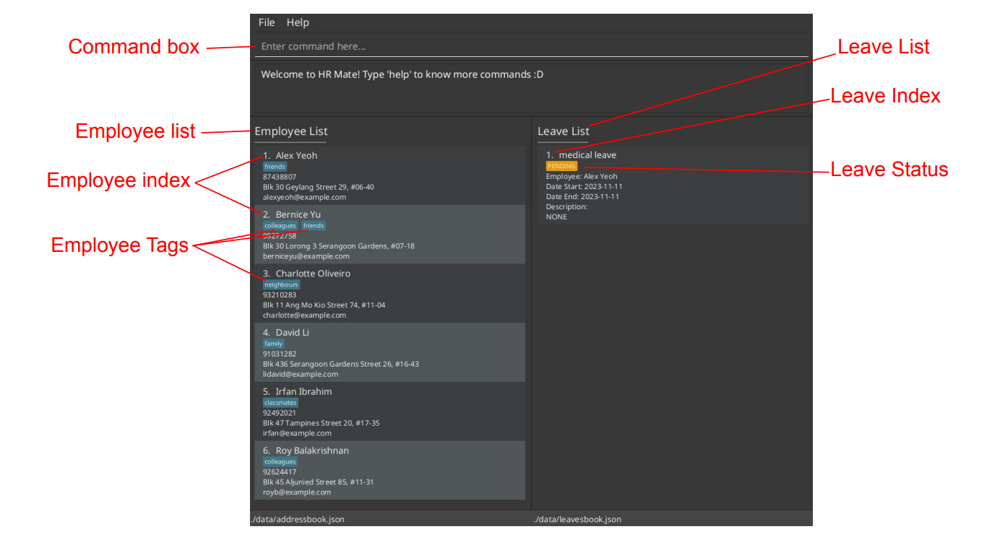
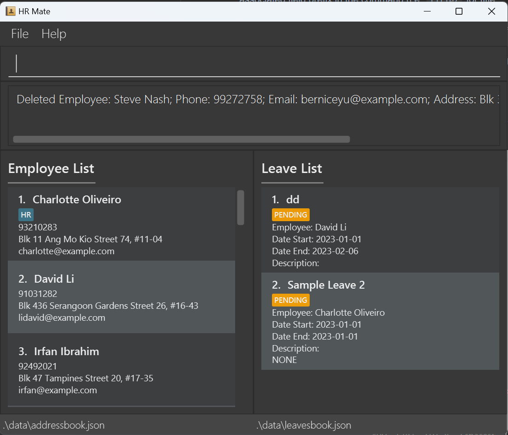
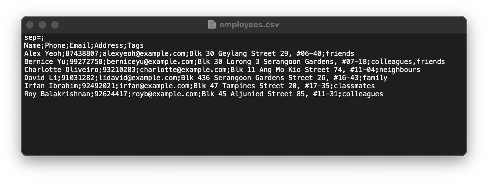
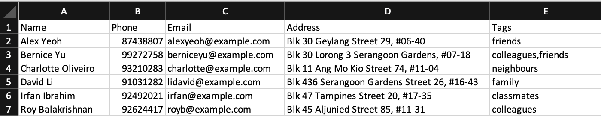
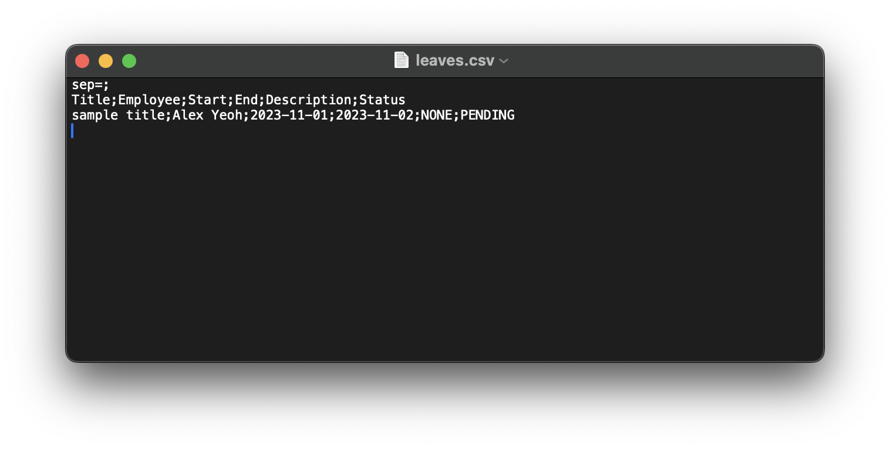

<frontmatter>
  layout: default.md
  pageNav: 3
  title: "User Guide"
</frontmatter>

# HRMate User Guide

Hi HR managers, this is HRMate. HRMate is a **desktop app for managing employee and leave records**.
HRMate uses a Command Line Interface ([CLI](#glossary)) and Graphical User Interface ([GUI](#glossary)).
That means that we are optimized for fast typers like you, and can help you complete your HR tasks faster than traditional HR apps like Oracle and SAP.
This user guide aims to help new users quickly familiarise themselves with HRMate and help experienced users to explore advanced features of HRMate, with the goal of using HRMate to better facilitate your HR needs.

<!-- * Table of Contents -->
<page-nav-print></page-nav-print>

--------------------------------------------------------------------------------------------------------------------

## Quick start

1. Download the latest `hrmate.jar` from [to be updated]() and move to your desired location. See [How do I move a file?](#faq) for help.

2. Open a terminal or your computer.

<box type="info" seamless>
    <ul>
        <li><strong>For Mac users:</strong> open the Terminal app on your Mac</li>
        <li><strong>For Window users:</strong> press the windows key, type `powershell` and press "Enter" on your keyboard</li>
    </ul>
    See <a href="#faq">How do I open a terminal?</a> for more information.
</box>

3. Use `cd` command in the terminal to navigate to the same location as `hrmate.jar` in step 1. See [How do I navigate files in terminal?](#faq)

4. Ensure you have Java `11` or above installed in your Computer. This can be done by typing `java -version` in your terminal.
 - See <a href="#faq">How do I download Java 11?</a> if Java is not updated or if the terminal does not recognise the `java` input. 

5. Type `java -jar hrmate.jar` into the terminal and press "enter" on your keyboard. 
An app similar to the one below should appear in a few seconds. The app is populated with some sample data for you to experiment with. 
We have added some annotations in red so that you can understand the app visually.

6. You can try typing some commands into the command box and pressing "enter" to execute. We have listed down some commands for you to try.  
 - `help` : Opens the help window.
 - `list` : Lists all contacts.
 - `add n/John Doe p/98765432 e/johnd@example.com a/John street, block 123, #01-01` : Adds a contact named `John Doe` to the employee list
 - `add-leave 1 title/medical leave start/2023-11-11 end/2023-11-11` : Adds an leave entry for the first employee in the current employee list. Note that the default leave status is `PENDING`.
 - `delete 3` : Deletes the 3rd employee shown in the current employee list.
 - `clear` : Deletes all employees and leaves.
 - `exit` : Exits the app.

6. Refer to [How to interpret command formats?](#how-to-interpret-command-formats) for more info on the command structure. 
Also, look through [Features](#features) for more commands and the details of each command. We hope to aid you in your HR journey!

--------------------------------------------------------------------------------------------------------------------

## Features

## Getting help
Should you need any help, you can access this online user guide (this document) with the `help` [command](#glossary).

### Getting help : `help`

1. Type in the following command in the [command box](#glossary): `help`. 
2. Press "Enter" on your keyboard.
3. The following pop up should show:

4. Click on the "copy link" button to copy the link to the user guide, and paste into any [web browser](#glossary) to access the user guide. Alternatively, click the red button at the corner of the window to close the pop up.

## Adding a new employee
When a new employee joins, you can use the `add` [command](#glossary) to add their information into HRMate.

### Adding an employee: `add`

1. Type in the following [command](#glossary) in the [command box](#glossary): `add n/NAME p/PHONE_NUMBER e/EMAIL_ADDRESS a/HOME_ADDRESS [t/TAG]...`, replace `NAME` with employee name, `PHONE_NUMBER` with employee phone number `EMAIL_ADDRESS` with employee email address and `HOME_ADDRESS` with employee home address. `[t/TAG]...` is an optional field with one or more [tags](#glossary), with `TAG` being the name of the tag.
 - For instance, if you have an employee name John Doe with phone number 98765432, email johnd@example.com, home address John Street, block 123 #01-01 and tags full-time and remote, type in the command `add n/John Doe p/98765432 e/johnd@example.com a/John Street, block 123 #01-01 t/full-time t/remote`
 - If your employee does not require any tags, using the same information as above, the command would be `add n/John Doe p/98765432 e/johnd@example.com a/John Street, block 123 #01-01`
 - Please refer to [how to interpret command formats](#how-to-interpret-command-formats) for more information
2. Press "enter" on your keyboard and you should see the person information at the end of the [employee list](#glossary). 

Here are the potential error messages that you may receive and here's how to fix them:

| Error message                                                                                                                                          | Why it happens                                                                                                  | Fix                                                                                                                                                                                                                                                                                                                                                                                                              |
|--------------------------------------------------------------------------------------------------------------------------------------------------------|-----------------------------------------------------------------------------------------------------------------|------------------------------------------------------------------------------------------------------------------------------------------------------------------------------------------------------------------------------------------------------------------------------------------------------------------------------------------------------------------------------------------------------------------|
| `Invalid command format!`                                                                                                                              | The command you input does not follow the specified format                                                      | Ensure the command you entered follows the following format: `add n/NAME p/PHONE_NUMBER e/EMAIL_ADDRESS a/HOME_ADDRESS [t/TAG]...`, replacing `NAME` with employee name, `PHONE_NUMBER` with employee phone number, `EMAIL_ADDRESS` with employee email address, `HOME_ADDRESS` with employee home address. `[t/TAG]...` is optional, with `[t/TAG]` representing one or more tags and `TAG` being the tag name. |
| `FIELD should FORMAT` where `FIELD` is an input like `Names` or `Phone numbers` and `FORMAT` contains additional information about the field's format. | The input does not follow the format prescribed. For example, the entered phone number might contain alphabets. | Follow the on screen message to fix the field in question. For example, `Phone numbers should only contain numbers, and it should be at least 3 digits long` means that the input phone number does not follow the prescribed format.                                                                                                                                                                            |
| `This employee already exists in the address book`                                                                                                     | The provided employee name is already found in HRMate                                                           | Use another name for the employee. For example, if trying to add another "John Doe", use the name "John Doe (HR)" to differentiate between the existing John Doe. HRMate does this name checking to prevent unintentional duplicate employee entries.                                                                                                                                                            |

## Listing all employees: `list`

* **What It Does:**
  * Shows a list of all employees in HRMate
* **Format:**
  * `list`
* **Examples:**

| S/N | Command information                                                                        |
|-----|--------------------------------------------------------------------------------------------|
| 1   | **Command:** `list`    **Output:** Shows a list of all employees in the address book |
* **Acceptable Values:**
  * This command has no parameters
* **Expected Output on Success:**
  * GUI Changes: A list of employees is displayed in a dedicated interface section
* **Expected Output on Failure:**
  * N/A (no expected failure)

## Editing employee records
HRMate offers different [commands](#glossary) for editing employee records. `add-tag` and `delete-tag` would add and remove an employee's [tags](#glossary) while `edit` is for editing name, phone number, email address, home address and tags.

### Adding tags to employees : `add-tag`

1. Find the employee under the [employee list](#glossary).

<box type="info" seamless>
If the employee is not found, consider using <a href="">list</a> or any <a href="">find commands</a> to locate the employee in the employee list.
</box>

2. Type in the following [command](#glossary) in the [command box](#glossary) `add-tag INDEX t/TAG...` where `INDEX` is the [index](#glossary) of the employee in the list currently, `TAG` is the name of the [tag](#glossary) to be added and `t/TAG...` representing one or more tags. 
 - For instance, if you want to add the tags full-time and remote to the employee indexed 2, type `add-tag 2 t/full-time t/remote` to the command box.
 - Please refer to [how to interpret command formats](#how-to-interpret-command-formats) for more information
3. Press "enter" on your keyboard and you should see the input tags added to the employee specified.

Here are the potential error messages that you may receive and here's how to fix them:

| Error message                                                         | Why it happens                                                        | Fix                                                                                                                                                                                                                                     |
|-----------------------------------------------------------------------|-----------------------------------------------------------------------|-----------------------------------------------------------------------------------------------------------------------------------------------------------------------------------------------------------------------------------------|
| `Invalid command format!`                                             | The command you input does not follow the specfied format             | Ensure the command you entered follows the following format: `add-tag INDEX t/TAG...`, replacing INDEX with the index of the employee currently, `TAG` is the name of the tag to be added and `t/TAG...` representing one or more tags. |
| `At least one tag must be provided`                                   | No tags were provided                                                 | Add tags to the command in the command box. Note that the tags must have a t/ [prefix](#glossary). For example, to add the tag full-time, use `t/full-time`.                                                                            |
| `The person index provided is invalid`                                | The index specified does not refer to any employee                    | Double check if the index appears in the employee list. Alternatively, use [list]() or any [find commands]() to locate the employee in the employee list. Afterwards, use the correct employee index in the `add-tag` command.          |
| `The employee already has some of the tags`                           | The employee already has some of the tags which you are trying to add | Remove the tags the employee has from the input command. For example, for an employee who already has the full-time tag, the command `add-tag 2 t/full-time t/remote` would not work. Instead try `add-tag 2 t/remote`.                 |
| `Tags names only allows alphanumeric characters, spaces, and dashes.` | The tags input contains illegal characters                            | Remove the illegal characters from the input.                                                                                                                                                                                           |

### Removing tags from employees : `delete-tag`
1. Get the [index](#glossary) of the employee in the [employee list](#glossary).

<box type="info" seamless>
If the employee is not found, consider using [list]() or any [find commands]() to locate the employee in the employee list.
</box>

2. Type in the following [command](#glossary) in the [command box](#glossary) `delete-tag INDEX t/TAG...` where `INDEX` is the index of the employee in the list currently, `TAG` is the name of the [tag](#glossary) to be deleted and `t/TAG...` representing one or more tags. 
 - For instance, if you want to remove the tags full-time and remote to the employee indexed 2, type `delete-tag 2 t/full-time t/remote` to the command box.
 - Please refer to [how to interpret command formats](#how-to-interpret-command-formats) for more information
3. Press "enter" on your keyboard and you should see the input tags removed from the employee specified.

Here are the potential error messages you may receive and here's how to fix them:

| Error message | Why it happens | Fix |
|---------------|----------------|-----|
| `Invalid command format!` | The command you input does not follow the specfied format | Ensure the command you entered follows the following format: `delete-tag INDEX t/TAG...`, replacing INDEX with the index of the employee currently, `TAG` is the name of the tag to be deleted and `t/TAG...` representing one or more tags. |
| `At least one tag must be provided` | No tags were provided | Add tags to the command in the command box. Note that the tags must have a t/ [prefix](#glossary). For example, to remove the tag full-time, use `t/full-time` |
| `The person index provided is invalid` | The index specified does not refer to any employee | Double check if the index appears in the employee list. Alternatively, use [list]() or any [find commands]() to locate the employee in the employee list. Afterwards, use the correct employee index in the `delete-tag` command. |
| `Some of the tags are not found on this employee.` | The employee does not have some of the tags you are trying to delete | Remove the tags not found on the employee from the input command. For example, for an employee without the tag full-time, the command `delete-tag 2 t/full-time t/remote` does not work. Instead try `delete-tag 2 t/remote`.|
| `Tags names only allows alphanumeric characters, spaces, and dashes.` | The tags input contains illegal characters | Remove the illegal characters from the input. |

### Editing the name, phone number, email address, home address or tags of employees : `edit`
1. Get the [index](#glossary) of the employee under the [employee list](#glossary).

<box type="info" seamless>
If the employee is not found, consider using <a href="">list</a> or any <a href="">find commands</a> to locate the employee in the employee list.
</box>

2. Type in the following [command](#glossary) in the [command box](#glossary) `edit INDEX [n/NAME] [p/PHONE_NUMBER] [e/EMAIL_ADDRESS] [a/HOME_ADDRESS] [t/TAG]...` where `INDEX` is the index of the employee in the list currently, `[n/NAME]`, `[p/PHONE_NUMBER]`, `[e/EMAIL_ADDRESS]`, `[a/HOME_ADDRESS]` are optional fields which require changing, replacing `NAME` with employee name, `PHONE_NUMBER` with employee phone number, `EMAIL_ADDRESS` with employee email address and `HOME_ADDRESS` with employee home address. `[t/TAG]...` is an optional field representing one or more [tags](#glossary) where `TAG` is the tag name. Note that at least one field to edit must be present and only the fields present will be edited.
 - For example, to change the phone number, email address and tags of the employee indexed 2 to 98765432, johndoe@example.com and full-time and remote, type in the command `edit 2 p/98765432 e/johndoe@example.com t/full-time t/remote`. Note that the name and home address will remain unchanged.
 - In another example, to change the home address of the employee indexed 1 to John street, block 123 #01-01 and remove all tags from the employee, type in the command `edit 1 a/John street, block 123 #01-01 t/`. Note that the name, phone number and email_address will remain unchanged.
 - Please refer to [how to interpret command formats](#how-to-interpret-command-formats) for more information

<box type="warning" seamless>
If the tag prefix is specified, all existing tags under the employee will be removed and replaced with the new tags in the command.
In the first example, the employee will have all tags removed and replaced by 2 tags: full-time and remote.
In the second example, the employee will have all tags removed. No tags will be added since no tags are specified.
Therefore, to avoid unintentionally losing any information while editing tags, we recommend using the <a href="#adding-tags-to-employees--add-tag">add tag</a> and <a href="#removing-tags-from-employees--delete-tag">delete-tag</a> commands instead for editing tags.
</box>

3. Press "enter" on your keyboard and you should see the changes applied to the employee.

| Error message                                                                                                                                          | Why it happens                                                                                                  | Fix                                                                                                                                                                                                                                                                                                                                                                                                                                                                                                                                                                                                             |
|--------------------------------------------------------------------------------------------------------------------------------------------------------|-----------------------------------------------------------------------------------------------------------------|-----------------------------------------------------------------------------------------------------------------------------------------------------------------------------------------------------------------------------------------------------------------------------------------------------------------------------------------------------------------------------------------------------------------------------------------------------------------------------------------------------------------------------------------------------------------------------------------------------------------|
| `Invalid command format!`                                                                                                                              | The command you input does not follow the specified format                                                      | Ensure the command you entered follows the following format: `edit INDEX [n/NAME] [p/PHONE_NUMBER] [e/EMAIL_ADDRESS] [a/HOME_ADDRESS] [t/TAG]...` where `INDEX` is the index of the employee in the list currently, `[n/NAME]`, `[p/PHONE_NUMBER]`, `[e/EMAIL_ADDRESS]`, `[a/HOME_ADDRESS]` are optional fields which require changing, replacing `NAME` with employee name, `PHONE_NUMBER` with employee phone number, `EMAIL_ADDRESS` with employee email address and `HOME_ADDRESS` with employee home address. `[t/TAG]...` is an optional field representing one or more tags where `TAG` is the tag name. |
| `FIELD should FORMAT` where `FIELD` is an input like `Names` or `Phone numbers` and `FORMAT` contains additional information about the field's format. | The input does not follow the format prescribed. For example, the entered phone number might contain alphabets. | Follow the on screen message to fix the field in question. For example, `Phone numbers should only contain numbers, and it should be at least 3 digits long` means that the input phone number does not follow the prescribed format.                                                                                                                                                                                                                                                                                                                                                                           |
| `The person index provided is invalid`                                                                                                                 | The index specified does not refer to any employee                                                              | Double check if the index appears in the employee list. Alternatively, use [list]() or any [find commands]() to locate the employee in the employee list. Afterwards, use the correct employee index in the `edit` command.                                                                                                                                                                                                                                                                                                                                                                                     |
| `At least one field to edit must be provided`                                                                                                          | The command you input does not contain any fields to edit                                                       | Check if there is any input fields in the command inputted. An input like `edit 1` is not accepted as there is no edits to be made.                                                                                                                                                                                                                                                                                                                                                                                                                                                                             |
| `This employee already exists in the address book`                                                                                                     | The provided employee name is already found in HRMate                                                           | Use another name for the employee. For example, if trying to add another "John Doe", use the name "John Doe (HR)" to differentiate between the existing John Doe. HRMate does this name checking to prevent unintentional duplicate employee entries.                                                                                                                                                                                                                                                                                                                                                           |

* **For advanced users:**
  * You can remove all the tags of an employee with `edit INDEX t/` (see warning above)

#### Removing an employee record : `delete`

1. Get the [index](#glossary) of the employee under the [employee list](#glossary). View this image in [quick start](#quick-start) for more information.
<box type="info" seamless>
If the employee is not found, consider using <a href= "#listing-all-employees-list">list</a> or any <a href= "#finding-employees">find commands</a> to locate the employee in the employee list.
</box>
2. Type in the following [command](#glossary) in the [command box](#glossary) `delete INDEX` where `INDEX` is to be replaced with the index of the employee in the list currently
 - For instance, to remove the whole record of the employee indexed 1, type `delete 1` to the command box.

<box type="warning" seamless>
Once you delete the record, the records will be no longer available in HRMate and cannot be recovered.
Therefore, to avoid unintentionally losing any information of the employee, if you just want to modify some information, we recommend using the
<a href= "#editing-the-name-phone-number-email-address-home-address-or-tags-of-employees--edit">edit</a> command instead to modify the record.
</box>

3. Press "enter" on your keyboard and you should see the employee removed from the employee list with all leaves related to that employee in the leave list being removed.

| Error message | Why it happens | Fix |
|---------------|----------------|-----|
| `Invalid command format!` | The command you input does not follow the specified format | Ensure the command you entered follows the following format: `add INDEX` where `INDEX` is the index of the employee in the list currently.|
| `The person index provided is invalid` | The index specified is not positive or does not refer to any employee | Double check if the index is positive and appears in the employee list. Alternatively, use [list](#listing-all-employees-list) or any [find commands](#finding-employees) to locate the employee in the employee list. Afterwards, use the correct employee index in the `delete` command. |
| `Index is not an integer.` | The index specified is not an integer | Check if the index is an integer, then use the correct employee index in the `delete` command.

### Viewing All Tags: `view-tag`

* **What It Does:**
  * Shows a list of all tags currently in use within the address book, which helps HR managers quickly identify different categories of employees.

* **Format:**
  * `view-tag`
* **Examples:**

| S/N | Command information                                                                                                         |
|-----|-----------------------------------------------------------------------------------------------------------------------------|
| 1   | **Command:** `view-tag`    **Output:** Shows a list of all tags assigned to at least one employee in the address book |

* **Acceptable Values:**
  * This command doesn't require any parameters.
* **Expected Output on Success:**
  * GUI Changes: A list of tags is displayed in a dedicated interface section.
  * Message shown to the user: "Successfully fetched all tags."
* **Expected Output on Failure:**
  * Error messages: N/A (since no parameters are involved, the command will not fail due to invalid input)

### Finding employees
#### Finding employees by name: `find`
  1. Type in the following [command](#glossary) in the [command box](#glossary) `find NAME....` where `NAME...` are to be replaced with one or more names of the employees for search.
     * The words for search are case insensitive, meaning you do not have to worry about the capitalization of the words entered. 
  - For instance, to find employees whose names contain `Martin`, type `find martin` to the command box.
  - For another instance, to find employees whose names contain either "*Harry*" or "*Redknapp*, type `find harry redknapp` to the command box.
  - However, if you want to find employees whose names contain `martin` but only entered `mar`, NO employee named Martin will be found, instead employee named Mar will be found. Note that he search looks for names containing the entire specified word.
  2.  Press "enter" on your keyboard and you should see the employees matched being listed in the employee list.
    
| Error message | Why it happens | Fix |
|---------------|----------------|-----|
| `Invalid command format!` | The command you input does not follow the specified format | Ensure the command you entered follows the following format: `find NAME...` where `NAME` is the specified name of the employee to search (case-insensitive).
                                                                                                                                                                                            
* **For advanced users:**
  * Employees are displayed in the order in which they are arranged in the employee list.

#### Finding employees by all specified tags: `find-all-tag`

1. Type in the following [command](#glossary) in the [command box](#glossary) `find-all-tag t/TAG [t/MORE_TAGS]...` where `TAG` is to be replaced with the name of the [tags](#glossary).
   * At least one tag should be entered for search and more tags can be entered if you want to search for more.
   * The tag names are case sensitive, meaning the capitalization of the words entered matters. 
  - For instance, to find employees with both tag `remote` and tag `full time`, type `find-all-tag t/remote t/full time` to the command box.
  - However, if you want to find employees with tag `remote`, but only entered `re` as the tag name, NO employees with tag `remote` will be found, instead, employees with tag `re` will be found. Note that only tags containing the entire specified word are matched.
2.  Press "enter" on your keyboard and you should see the employees matched being listed in the employee list. Note that employees with additional tags other than the specified ones will also be displayed.
    
| Error message | Why it happens | Fix |
|---------------|----------------|-----|
| `Invalid command format!` | The command you input does not follow the specified format | Ensure the command you entered follows the following format: `find-all-tag t/TAG [t/MORE_TAGS]...`  where `TAG` is to be replaced with the name of the [tags](#glossary), and capitalization of the tag names mattered (case-sensitive). At least one tag should be entered for search and more tags can be entered if you want to search for more. |
| `Tags names only allow alphanumeric characters, spaces, and dashes.` | The tags input contains illegal characters | Remove the illegal characters from the input. |
                                                                                                                                                                                            
* **For advanced users:**
  * Employees are displayed in the order in which they are arranged in the employee list.

#### Finding employees by at least one specified tag: `find-some-tag`

1. Type in the following [command](#glossary) in the [command box](#glossary) `find-some-tag t/TAG [t/MORE_TAGS]...` where `TAG` is to be replaced with the name of the [tags](#glossary).
   * At least one tag should be entered for search and more tags can be entered if you want to search for more.
   * The tag names are case sensitive, meaning the capitalization of the words entered matters. 
  - For instance, to find employees with either tag `remote` and tag `full time`, type `find-some-tag t/remote t/full time` to the command box.
  - However, if you want to find employees with tag `remote`, but only entered `re` as the tag name, NO employees with tag `remote` will be found, instead, employees with tag `re` will be found. Note that only tags containing the entire specified word are matched.
2.  Press "enter" on your keyboard and you should see the employees matched being listed in the employee list. Note that employees with additional tags other than the specified ones will also be displayed.
    
| Error message | Why it happens | Fix |
|---------------|----------------|-----|
| `Invalid command format!` | The command you input does not follow the specified format | Ensure the command you entered follows the following format: `find-all-tag t/TAG [t/MORE_TAGS]...` where `TAG` is to be replaced with the name of the [tags](#glossary), and capitalization of the tag names mattered (case-sensitive). At least one tag should be entered for search and more tags can be entered if you want to search for more. |
| `Tags names only allow alphanumeric characters, spaces, and dashes.` | The tags input contains illegal characters | Remove the illegal characters from the input. |
                                                                                                                                                                                            
* **For advanced users:**
  * Employees are displayed in the order in which they are arranged in the employee list.

### Adding a new leave
When an employee apply for leave, you can use the `add-leave` [command](#glossary) to add their leave into HRMate leave list.
#### Adding a leave record: `add-leave`
1. Get the [index](#glossary) of the employee under the [employee list](#glossary). View this image in [quick start](#quick-start) for more information.

<box type="info" seamless>
If the employee is not found, consider using <a href= "#listing-all-employees-list">list</a> or any <a href= "#finding-employees">find commands</a> to locate the employee in the employee list.
</box>

2. Type in the following [command](#glossary) in the [command box](#glossary) `add-leave INDEX title/TITLE start/START_DATE end/END_DATE [d/DESCRIPTION]`, replace
   * `NAME` with the index of the employee applied for leave in the employee list
   * `Title` with the title of the leave
   * `START_DATE` with the start date of the leave
   * `END_DATE` with the end date of the leaves and it must be the same as or later than the start date. Dates are in a format of `yyyy-MM-dd`
   * `[d/DESCRIPTION]` is an optional field with `DESCRIPTION` to be replaced with the description of the leave.
   * Note that duplicated title and concurrent leave (overlapping date duration of leaves) are allowed.
  - For instance, to add a leave of one day on 2023-11-01 to employee indexed 1 with a title of `Sample Leave 1`, type `add-leave 1 title/Sample Leave 1 start/2023-11-01 end/2023-11-01`` to the command box.
  - For another instance, to add a leave of two days from 2023-11-01 to 2023-11-02 to employee indexed 2 with a title of `Sample Leave 2` and a description of `Sample Description`, type `add-leave 2 title/Sample Leave 2 start/2023-11-01 end/2023-11-02 d/Sample Description` to the command box.
<box type="info" seamless>
There is a status field of leave that is `PENDING` by default when a leave is added. Please DO NOT enter any status field of the leave, no recognitions of status field and any other prefix are provided.
Therefore, to change the status of a leave, please use the <a href= "#approve-leave-record-by-index-approve-leave">approve-leave</a> or <a href= "#reject-leave-record-by-index-reject-leave">reject-leave</a> commands instead to modify the record.
</box>

3. Press "enter" on your keyboard and you should see the leave information at the end of the overall [leave list](#glossary). Note that if there is no description field added, the description will be `NONE` by default.
    
| Error message | Why it happens | Fix |
|---------------|----------------|-----|
| `Invalid command format!` | The command you input does not follow the specified format | Ensure the command you entered follows the following format: `add-leave INDEX title/TITLE start/START_DATE end/END_DATE [d/DESCRIPTION]`, replace `NAME` with the index of the employee applied for leave in the employee list, `Title` with the title of the leave, `START_DATE` with the start date of the leave and `END_DATE` with the end date of the leaves and it must be the same as or later than the start date. Dates are in a format of `yyyy-MM-dd`. `[d/DESCRIPTION]` is an optional field with `DESCRIPTION` representing the description of the leave. Note that duplicated title and concurrent leave (overlapping date duration of leaves) are allowed.|
| `This leave has already existed for the employee` | The start date and end date are exactly the same as the existing leave | Double check if the dates for the new leave do not have the same dates as the existing ones by checking against the list from [find-leave](#find-leave-records-belonging-to-an-employee-find-leave) or [find-leave-range](#find-leave-records-by-time-period-find-leave-range). You may choose to [edit-leave](#editing-a-leave-record-edit-leave) if the new leave has the exact same start and end dates as the existing leave, in other words, they are the same leave. |
| `The person index provided is invalid` | The index specified is not positive or does not refer to any employee | Double check if the index is positive and appears in the employee list. Alternatively, use [list](#listing-all-employees-list) or any [find commands](#finding-employees) to locate the employee in the employee list. Afterwards, use the correct employee index in the `add-leave` command. |
| `Index is not an integer.` | The index specified is not an integer | Check if the index is an integer, then use the correct employee index in the `add-leave` command.
| `Leave titles should only contain alphanumeric characters, spaces, and dashes. It should not be blank` | Title input is blank and/or contains illegal characters | Add title and/or remove the illegal characters from the input |
| `The end date is earlier than the start date!` | The end date input is earlier than the start date input | Double check the date inputs. |
| `Date should be valid and in a format of `yyyy-MM-dd`` | The start date and end date inputs are not in the correct format | Ensure that the inputs of dates are in the format of `yyyy-MM-dd`, for example, `2023-01-01`. |
| `Leave descriptions should only contain alphanumeric characters, spaces, dashes, commas, apostrophes and full stops.` | Description input contains illegal characters | Remove the illegal characters from the input.

### Editing a leave record: `edit-leave`
* **What It Does:**
  * Edits an existing leave record in HRMate based on their index

* **Format:**
  * `edit-leave INDEX [title/TITLE] [start/START_DATE] [end/END_DATE] [d/DESCRIPTION] [s/STATUS]`
    
* Examples:

| S/N | Command information |
|-----|------|
| 1   | **Command:** `edit-leave 1 title/medical leave start/2023-11-01`   **Output**: Edits the leave record with index 1 to have the below changes: <ul><li>Title: medical leave</li><li>Start date: 2023 November 1st</li><li>No changes to the other fields</li></ul> |
| 2   | **Command:** `edit-leave 2 end/2023-11-02 d/not free until 11pm s/APPROVED`   **Output**: Edits the leave record with index 2 to have the below changes: <ul><li>End date: 2023 November 2nd</li><li>Description: not free until 11pm</li><li>Status: APPROVED</li></ul> |

* **Acceptable value:**
  * The specified `INDEX` must match with a leave record shown in the displayed leave list.
  * At least one leave record's field must be changed (`edit-leave 1` would be invalid as no leave record field are changed)
  * Only fields specified will be modified; fields not specified in the command will not be modified. A field is specified by including its associated field prefix in the command (i.e. `title/` for title, `start/` for start date etc.)
  * For title: if this field is included in the command, it cannot be left empty (i.e. `title/` is not allowed)
  * For start and end: if these fields are included in the command, they must be in the format yyyy-mm-dd (like 2023-11-01 for 2023 November 1st). Additionally, the start date must be before or equals to the end date.
  * For status: if this field is included in the command, it must be either APPROVED, PENDING or REJECTED

* **Expected output on failure:**
  * `At least one field to edit must be provided` - if no fields are provided
  * `The leave index provided is invalid` - if the index provided does not match with any leave record in the displayed leave list
  * `FIELD must be of format...` - if at least one of the field inputs violates the field's format requirements. Follow the displayed error message to fix the format error.
  * `end date cannot be before start date` - the end date provided is before the current or provided start date

### Removing a leave record: `delete-leave`

* **What It Does:**
  * Removes an existing leave record form HRMate, so that the leave's record is no longer available in HRMate.
* **Format:**
  * `delete-leave LEAVE_LIST_INDEX`
* **Examples:**

| S/N | Command information                                                                                                                                                                                                                                                    |
|-----|------------------------------------------------------------------------------------------------------------------------------------------------------------------------------------------------------------------------------------------------------------------------|
| 1   | **Command:** `delete-leave 1`    **Output:** Deletes the leave record with index 1. For instance, if the leave record titled "medical leave" with employee "David de Gea" is indexed 1, then "medical leave" is removed from HRMate and no longer available.     |
| 2   | **Command:** `delete-leave 2`    **Output:** Deletes the leave record with index 2. For instance, if the leave record titled "childcare leave" with employee "Carlos Puyol" is indexed 2, then "childcare leave" is removed from HRMate and no longer available. |

* **Acceptable Values:**
  * The specified `LEAVE_LIST_INDEX` must correspond to an index number shown in the leave book. It must be a valid number, larger than zero, and cannot exceed the number of entries in the leave book.
* **Expected Output on Success:**
  * GUI Changes: The leave record of the specified index will no longer appear in the list of leave records.
  * Message shown to user: "[leave title] deleted"
* **Expected Output on Failure:**
  * `Leave list index does not exist` - An invalid index was specified.
  * `Employee list index not specified` - No index was specified by the user.

### Approve leave record by index: `approve-leave`

* **What It Does:**
  * Approve a leave record by the given index
  * **Format:**
  * `approve-leave INDEX`
* **Examples:**

| S/N | Command information                                                                                                                                                                     |
|-----|-----------------------------------------------------------------------------------------------------------------------------------------------------------------------------------------|
| 1   | **Command:** `approve-leave 1`    **Output:** Approve the leave record of index 1|

* **Acceptable Values:**
  * The index should be a positive number starting from 1 and within the range of the leave list.
* **Expected Output on Success:**
  * GUI Changes: The approved leave will be marked as approved with green highlight.
  * Message shown to user: "Approved Leave:” with the information of the approved leave
* **Expected Output on Failure:**
  * `Leave previously approved: `with the information of the previously approved leave - the leave given by the index was previously approved
  * `The leave index provided is invalid:  - the index is out of bounds

### Reject leave record by index: `reject-leave`

* **What It Does:**
  * Reject a leave record by the given index
  * **Format:**
  * `reject-leave INDEX`
* **Examples:**

| S/N | Command information                                                                   |
|-----|---------------------------------------------------------------------------------------|
| 1   | **Command:** `reject-leave 1`    **Output:** Reject the leave record of index 1 |

* **Acceptable Values:**
  * The index should be a positive number starting from 1 and within the range of the leave list.
* **Expected Output on Success:**
  * GUI Changes: The rejected leave will be marked as rejected with red highlight.
  * Message shown to user: "Rejected Leave:” with the information of the rejected leave
* **Expected Output on Failure:**
  * `Leave previously Rejected: `with the information of the previously rejected leave - the leave given by the index was previously rejected
  * `The leave index provided is invalid:`  - the index is out of bounds

### Find leave records by time period: `find-leave-range`

* **What It Does:**
  * Finds all leave records in HRMate in a given time period. There are 4 possible scenarios:
  * 1) The time period has a start date and an end date (inclusive) - all leaves with at least one day that falls within
      this period will be displayed
    2) The time period only has a start date (inclusive) - all leaves that either occur on the start date or will occur
      after the start date will be displayed
    3) The time period only has an end date (inclusive) - all leaves that either occur on the end date or will finish
      before the end date will be displayed
    4) The time period does not have a start date or end date - all leaves will be returned
* **Format:**
  * `find-leave-range [start/START_DATE] [end/END_DATE]`
* **Examples:**

| S/N | Command information                                                                                                                                                                     |
|-----|-----------------------------------------------------------------------------------------------------------------------------------------------------------------------------------------|
| 1   | **Command:** `find-leave-range start/2023-10-27 end/2023-11-03`    **Output:** Returns all leaves that have at least one day in the period of 2023-10-27 and 2023-11-03 inclusive |
| 2   | **Command:** `find-leave-range start/2023-10-27`    **Output:** Returns all leaves that have at least one day either on or after 2023-10-27                                       |
| 3   | **Command:** `find-leave-range end/2023-11-03`    **Output:** Returns all leaves that have at least one day on or before 2023-11-03                                               |
| 4   | **Command:** `find-leave-range`    **Output:** Returns all leaves                                                                                                                 |

* **Acceptable Values:**
  * The dates provided for START_DATE and END_DATE must be of the format `yyyy-MM-DD`
  * If both end date and start date are provided, the end date cannot occur before the start date
* **Expected Output on Success:**
  * GUI Changes: All leave applications that fall within the queried time period will be returned
  * Message shown to user: "[number of leaves matched] leaves listed!"
* **Expected Output on Failure:**
  * `The end date is earlier than the start date!` - the start date cannot occur after the end date

### Find leave records by leave status: `find-leave-status`

* **What It Does:**
  * Finds all leave records in HRMate that have a particular status (either APPROVED/PENDING/REJECTED), so that you can
  * see which leaves still require approval
* **Format:**
  * `find-leave-status STATUS`
* **Examples:**

| S/N | Command information                                                                                               |
|-----|-------------------------------------------------------------------------------------------------------------------|
| 1   | **Command:** `find-leave-status APPROVED`    **Output:** Returns all leaves that have already been approved |
| 2   | **Command:** `find-leave-status PENDING`    **Output:** Returns all leaves that are still pending approval  |
| 3   | **Command:** `find-leave-status REJECTED`    **Output:** Returns all leaves that have been rejected         |

* **Acceptable Values:**
  * Status must be either "APPROVED", "PENDING", or "REJECTED". If the value is not in uppercase, the command will still be
    accepted, but all other values are rejected.
* **Expected Output on Success:**
  * GUI Changes: All leave applications that have the requested status will be returned
  * Message shown to user: "[number of leaves matched] leaves listed!"
* **Expected Output on Failure:**
  * `Command should only contain one of the following words: APPROVED / PENDING / REJECTED` - you provided an invalid status,
    try either `APPROVED`, `PENDING`, or `REJECTED` instead

### View all leaves: `find-all-leave`

* **What It Does:**
  * Shows all leave records in HRMate
* **Format:**
  * `find-all-leave`
* **Examples:**

| S/N | Command information                                                                      |
|-----|------------------------------------------------------------------------------------------|
| 1   | **Command:** `find-all-leave`    **Output:** Returns all leaves in the application |

* **Expected Output on Success:**
  * GUI Changes: All leave applications will be returned
  * Message shown to user: "Current # of Leave Request(s): [Number of leave applications]"
  * If there are no leave applications on the app, the message shown to the user is: "There are currently no leave requests."
* **Expected Output on Failure:**
  * None, this command is not expected to fail

### Find leave records belonging to an employee: `find-leave`

* **What It Does:**
  * Finds all leave records that are associated with an employee, so that you can see the person's leave history and 
  * upcoming leaves
* **Format:**
  * `find-leave INDEX`
* **Examples:**

| S/N | Command information                                                                                                                                                                                              |
|-----|------------------------------------------------------------------------------------------------------------------------------------------------------------------------------------------------------------------|
| 1   | **Command:** `find-leave 1`    **Output:** Returns all leaves associated with the employee with index 1. For instance, if the employee "John Smith" has employee index 1, John's leaves will be displayed. |

* **Acceptable Values:**
  * The specified `INDEX` must match with a employee record shown in the displayed employee list.
* **Expected Output on Success:**
  * GUI Changes: All leave applications associated with the requested employee will be returned.
  * Message shown to user: "[number of leaves matched] leaves listed!"
* **Expected Output on Failure:**
  * `The person index provided is invalid` - The index you provided does not match with any known employee. To resolve this,
    make sure that the employee that you are requesting for is currently displayed in the employee list. Use the number to
    the left of the employee's name as the index
  * `Invalid command format` - There was no employee index provided, please make sure that you supply a number as the index
--------------------------------------------------------------------------------------------------------------------

## Importing/Exporting employee records
It's painful having to add in each employee into HRMate manually. That's why HRMate provides import and export commands,
so you can bring in all your records from Excel with just a single command!

With the import and export commands, HRMate can read and save files in [CSV](#csv) format, which is supported
by major spreadsheet applications such as Microsoft Excel. 

### Importing employee records : `import`

<box type="warning" seamless>
Imported employee records will overwrite existing employee records in HRMate. Remember to make a copy of your existing
employee records if you want to save them! You can do so by <a href="#exporting-employee-records-export">exporting your current records</a>.
</box>

Here's how you can bring over your records from Excel:

1. Export your Excel save file in CSV format. Ensure that the separator is set to be a semicolon(`;`), and that you have
the following fields: Name, Phone, Email, Address, Tags. Note that tags in the Tags field have to be separated by commas.
   * You may skip this step if you already have a CSV file (e.g. you are importing a previously exported CSV file generated by
   HRMate)

<box type="warning" seamless>
If you have saved or edited your CSV file in Excel, please note that Excel will likely change the separator into a comma,
which will cause problems when trying to import employee records. To fix this problem, 
<a href="#excel-separator-faq">click here</a> to find out how you
can change the separator to semicolons in Excel. Note that this workaround is currently available only for Windows users.
</box>

2. If you are unsure how your file should look like, you may refer to the following images:
   * Here's how your CSV file should look like if you open it up in Notepad:
   
     * It is okay if your CSV file does not contain the first line `sep=;`, as this is a line added to files exported by HRMate
     to help Excel open the file. Do ensure the next line has to be the following:
     `Name;Phone;Email;Address;Tags` in order for HRMate to read it. Also note that tags are separated by commas 
     (see `colleagues, friends` under `Bernice Yu`'s row).
   * If you open your CSV file in Excel, your file should look like this:
    
    
   
    
    
     * Do ensure that the first row contains the following headers: `Name`, `Phone`, `Email`, `Address`, and `Tags`. 
     Note that tags, if present, should be separated by commas (see cell `E3` for an example).

3. In HRMate, type in the following command in the command box: `import`
4. In the file dialog that opens up, go to where you saved your exported CSV file, click on it, and click on the Open button.
5. You should see your employee records show up in HRMate, along with the message "Employee records have been imported from [your file name]!"

Here are some possible error messages you might encounter and here's how you can fix them:

| Error Message                                                        | Why it happens                                                               | Fix                                                                               |
|----------------------------------------------------------------------|------------------------------------------------------------------------------|-----------------------------------------------------------------------------------|
| Employee records were not imported.                                  | You did not select a file in the file dialog                                 | Retype the command, and make sure to select a CSV file when the file dialog opens |
| Records in file [file name] could not be imported, import cancelled. | Your file likely contains illegal characters or is corrupted                 | Ensure that your data fulfils the following constraints (to be added)             |
| No valid records found in file [file name], import cancelled         | Your file either is empty or does not contain a single valid employee record | Ensure that your file is non-empty and fulfils the abovementioned constraints     |                                                     

### Exporting employee records : `export`

Not only can you bring your data into HRMate, you can also bring your data out of HRMate. HRMate's export feature allows you
to export either the entire set of employee records, or employee records with a particular filter applied (e.g. only export
all full-time employees, which are tagged with "Full time"). You can then either store your exported CSV file for future use,
open it in a different application, or send it to another employee for them to import!

Here's how you can export your data out of HRMate:

1. In HRMate, type in the following command in the command box: `export [file name]`, replacing `[file name]` with the name
you will like to give your file. Your files will be saved in CSV format automatically.
   - For instance, if you would like to save your file as  `employees.csv`, type in the command `export employees`
2. You should see the message "Employee records have been saved to [file name]!"
3. To retrieve your exported file, go to the folder in which HRMate is stored in your File Explorer (if using Windows) or
Finder (if using Mac OS). From there, click on the `export` folder.
4. You should see your file in the `export` folder.

Here are potential error messages that you may receive and here's how to fix them:

| Error Message                                                       | Why it happens                                   | Fix                                                                                                                                                                                                                   |
|---------------------------------------------------------------------|--------------------------------------------------|-----------------------------------------------------------------------------------------------------------------------------------------------------------------------------------------------------------------------|
| Employee records could not be saved!                                | You do not have the permission to write the file | Try renaming your file name when typing out the command, especially if the previous name refers to an existing file. If not, move HRMate to a different folder where you can create files, and run the command again. |      

--------------------------------------------------------------------------------------------------------------------

## Importing/Exporting leave records
The import and export feature extends to importing and exporting leaves. This allows you to generate lists of leave
applications that can be opened in other major spreadsheet applications such as Microsoft Excel.

### Importing leave records : `import-leave`

<box type="warning" seamless>
Imported leave records will overwrite existing leave records in HRMate. Remember to make a copy of your existing
leave records if you want to save them! You can do so by <a href="#exporting-leave-records-export-leave">exporting your current records</a>.
</box>

Here's how you can bring over your leave records from Excel:

1. Export your Excel save file in CSV format. Ensure that the separator is set to be a semicolon(`;`), and that you have
   the following fields: Title, Employee, Start, End, Description, Status.
  * You may skip this step if you already have a CSV file (e.g. you are importing a previously exported CSV file generated by
    HRMate)
    
<box type="warning" seamless>
    If you have saved or edited your CSV file in Excel, please note that Excel will likely change the separator into a comma,
    which will cause problems when trying to import leave records. To fix this problem,
    <a href="excel-separator-faq">click here</a> to find out how you
    can change the separator to semicolons in Excel. Note that this workaround is currently available only for Windows users
</box>

2. If you are unsure how your file should look like, you may refer to the following images:
  * Here's how your CSV file should look like if you open it up in Notepad:
  
  * It is okay if your CSV file does not contain the first line `sep=;`, as this is a line added to files exported by HRMate
    to help Excel open the file. Do ensure the next line has to be the following:
    `Title;Employee;Start;End;Description;Status` in order for HRMate to read it.
    * If you open your CSV file in Excel, your file should look like this:
       
       
      
       
       
    * Do ensure that the first row contains the following headers: `Title`, `Employee`, `Start`, `End`, `Description`, and `Status`.
3. In HRMate, type in the following command in the command box: `import-leave`
4. In the file dialog that opens up, go to where you saved your exported CSV file, click on it, and click on the Open button.
5. You should see your leave records show up in HRMate, along with the message "Leave records have been imported from [your file name]!"

Here are some possible error messages you might encounter and here's how you can fix them:

| Error Message                                                       | Why it happens                                                            | Fix                                                                               |
|---------------------------------------------------------------------|---------------------------------------------------------------------------|-----------------------------------------------------------------------------------|
| Leave records were not imported                                     | You did not select a file in the file dialog                              | Retype the command, and make sure to select a CSV file when the file dialog opens |
| Records in file [file name] could not be imported, import cancelled | Your file likely contains illegal characters or is corrupted              | Ensure that your data fulfils the following constraints (to be added)             |
| No valid records found in file [file name], import cancelled        | Your file either is empty or does not contain a single valid leave record | Ensure that your file is non-empty and fulfils the abovementioned constraints     |                                                     

### Exporting leave records : `export-leave`

Not only can you bring your data into HRMate, you can also bring your data out of HRMate. HRMate's export feature allows you
to export either the entire set of leave application records, or leave records with a particular filter applied (e.g. only export
all leaves in a given time period). You can then either store your exported CSV file for future use,
open it in a different application, or send it to another employee for them to import!

Here's how you can export your data out of HRMate:

1. In HRMate, type in the following command in the command box: `export-leave [file name]`, replacing `[file name]` with the name
   you will like to give your file. Your files will be saved in CSV format automatically.
  - For instance, if you would like to save your file as  `today.csv`, type in the command `export today`
2. You should see the message "Leave records have been saved to [file name]!"
3. To retrieve your exported file, go to the folder in which HRMate is stored in your File Explorer (if using Windows) or
   Finder (if using Mac OS). From there, click on the `export` folder.
4. You should see your file in the `export` folder.

Here are potential error messages that you may receive and here's how to fix them:

| Error Message                     | Why it happens                                   | Fix                                                                                                                                                                                                                   |
|-----------------------------------|--------------------------------------------------|-----------------------------------------------------------------------------------------------------------------------------------------------------------------------------------------------------------------------|
| Leave records could not be saved! | You do not have the permission to write the file | Try renaming your file name when typing out the command, especially if the previous name refers to an existing file. If not, move HRMate to a different folder where you can create files, and run the command again. |
--------------------------------------------------------------------------------------------------------------------

## Resetting HRMate
After playing with the different features in HRMate, you might feel that it's time to delete HRMate's sample employee
contacts and instead use your own. Rather than manually deleting every employee contact and leave record, here's a
quick and easy way to clear them in the app!
### Resetting HRMate by clearing all existing records : `clear`

Here's how you can remove every employee contact and leave application from the app:

1. In HRMate, type this command into the [command box](#command-box): `clear` and press Enter.
2. That's it! You should notice that your [Employee List](#employee-list) and [Leave List](#leave-list) are both empty.
   You should also notice that the [Command Output Box](#command-output-box) will display the message:
   `All employee contacts and leave records have been cleared!` Now you have a clean slate and can start adding your
   own data!

**Warning:**
<box type="warning" seamless>
Be careful when using this command - resetting the application is permanent. If you have not already exported your
<a href="#exporting-employee-records-export">employee records</a> and
<a href="#exporting-leave-records-export-leave">leave records</a>, you will not be able to get them back!
</box>
--------------------------------------------------------------------------------------------------------------------

## Exit HRMate
Once you've finished your work, you might want to close HRMate. If you love typing over
clicking, you can close the app via keyboard too!

### Close the application: `exit`
Here's how you can close HRMate using your keyboard:

1. In HRMate, type this command into the [command box](#command-box): `exit` and press enter.
2. That's it! HRMate will now close, and you will find your employee records and leave records there the next time you
reopen HRMate.

--------------------------------------------------------------------------------------------------------------------

### Saving the data

HRMate data are saved in the hard disk automatically after any command that changes the data. There is no need to save manually.

### Editing the data file

HRMate data are saved automatically as a JSON file `[JAR file location]/data/hrmate.json`. Advanced users are welcome to update data directly by editing that data file.

* **Warning:**
  <box type="warning" seamless>
    If your changes to the data file makes its format invalid, HRMate will discard all data and start with an empty data file at the next run.  Hence, it is recommended to take a backup of the file before editing it.
  </box> 

--------------------------------------------------------------------------------------------------------------------

## How to interpret command formats

Example command formats: `add n/NAME p/PHONE_NUMBER e/EMAIL a/ADDRESS [t/TAG]...`, `add-tag INDEX t/TAG...`

The first command is used to add an employee while the second is used to add tags to a specified employee. Let's examine how the command is used.

| **Command component examples** | **What they mean** |
|--------------------------------|------------------------------------------------------------------------------------------------------------------------------------------------------------------------------------------------------------------------------------------------------------------------------------------------------------------------------------------------------------------------------------------------------------------------------------------------------------------|
| `add`, `add-tag`                            | The name of the command. The first word of the command is used to specify what command is used. |
| `n/NAME`, `p/PHONE_NUMBER`, `e/EMAIL`, `a/ADDRESS`, `t/TAG` | Mandatory command fields. These fields are used to provide further information that the commmand needs. The start of a field is denoted by a field prefix. |
| `n/`, `p/`, `e/`, `a/`, `t/` | Field prefix. These indicate what the field type is (name, phone number, email address etc.). They have a letter or phrase, followed by a backslash ("/"). This allows fields to be written in any order. For example, `edit 1 n/John Doe p/98765432` would have the same effect as `edit 1 p/98765432 n/John Doe`. |
| `INDEX` | The [index](#glossary) of the command. Some command requires an index to specified which employee or leave to act on. It must be the second word of the command, after the name of the command. |
| `[t/TAG]` | Optional command field. The square brackets ("[" and "]") indicates that a field is optional. However, some commands like [edit](#editing-the-name-phone-number-email-address-home-address-or-tags-of-employees--edit) have additional requirements like at least one of the optional fields must be specified. |
| `...` | Variable optional fields. This indicates that we can supply more than one field of the same type. When coupled with the optional command field ("[" and "]"), this means that zero or more command fields of that type can be provided. For example, `[t/TAG]...` indicates **zero** or more tags can be specified while `t/TAG...` indicates **one** or more tags can be specified. To specify multiple fields, use multiple tag prefixes. For instance, to use full-time and remote as tag fields to a command, type `t/full-time t/remote` |

**Notes**
* Parameters can be in any order  
  e.g. if the command specifies `n/NAME p/PHONE_NUMBER`, `p/PHONE_NUMBER n/NAME` is also
  acceptable.
* Extraneous parameters for commands that do not take in parameters (such as `help`, `list`, `exit` and `clear`) will be
  ignored  
  e.g. if the command `help 123` is executed, it will be interpreted as `help`.
* If you are using a PDF version of this document, be careful when copying and pasting commands that span multiple lines
  as space characters surrounding line-breaks may be omitted when copied over to the application.

--------------------------------------------------------------------------------------------------------------------

## FAQ

**Q**: How do I transfer my data to another Computer? 
**A**: We recommend using the [import and export command for employee](#importingexporting-employee-records) and [import and export command for leave records](#importingexporting-leave-records).

**Q**: How do I move a file? 
**A**: For **windows**, first open File Explorer and find the file. Afterwards, drag the selected file's icon to the desired location using your mouse. For more help, please consult the [Microsoft documentation](https://support.microsoft.com/en-gb/office/move-or-copy-an-item-to-another-folder-19768dfe-86c4-40bf-b82c-1c084b624492) 
For **mac**, first open Finder and find the specific file. Then drag it to the desired location using the mouse. For more help, please consult the [Apple documentation](https://support.apple.com/en-sg/guide/mac-help/mh26885/mac).

**Q**: How do I open a terminal? 
**A**: For **windows**, press the windows key, type in `powershell` and press Enter. The terminal should open. For more help, please consult the [Microsoft documentation](https://learn.microsoft.com/en-us/windows/terminal/install).
For **mac**, open the terminal app on your mac. For more help, please consult the [Apple documentation](https://support.apple.com/en-sg/guide/terminal/apd5265185d-f365-44cb-8b09-71a064a42125/mac#:~:text=Terminal%20for%20me-,Open%20Terminal,%2C%20then%20double%2Dclick%20Terminal.).

**Q**: How do I navigate files in terminal? 
**A**: You can use the `cd` command to navigate in terminal. For more information, please consult this [documentation](https://www.ibm.com/docs/en/aix/7.2?topic=directories-changing-another-directory-cd-command). 

**Q**: How do I download Java 11? 
**A**: Please refer to the official Java installation instructions [here](https://docs.oracle.com/en/java/javase/21/install/overview-jdk-installation.html#GUID-8677A77F-231A-40F7-98B9-1FD0B48C346A)

**Q**: How do I change the separator of my CSV file into semicolons(`;`) in Excel? 
**A**: Follow these steps to change the separator when exporting:
* If you are using Windows, follow these steps:
  1. In Excel, click on File > Options > Advanced.
  2. Under Editing options, uncheck the `Use system separators` check box.
  3. Change the Decimal separator to a comma (`,`) and the Thousands separator to a period (`.`).
  4. Save your file. When saving your file, change the save type (`Save as type`) to `CSV (Coma delimited) (*.csv)`
  5. After saving your file, remember to reset your Excel separators. Repeat steps 1 and 2, only that this time remember to
    check the `Use system separators` check box instead.
   
   
* Unfortunately, if you are using Mac OS, Excel makes it very difficult to change the separator
to semicolons. Stay tuned for future releases that will extend support for Mac OS!
--------------------------------------------------------------------------------------------------------------------

## Known issues

1. **When using multiple screens**, if you move the application to a secondary screen, and later switch to using only the primary screen, the GUI will open off-screen. The remedy is to delete the `preferences.json` file created by the application before running the application again.

--------------------------------------------------------------------------------------------------------------------

## Command summary

| Action                    | Format, Examples                                                                                                                                                      |
|---------------------------|-----------------------------------------------------------------------------------------------------------------------------------------------------------------------|
| **Add**                   | `add n/NAME p/PHONE_NUMBER e/EMAIL a/ADDRESS [t/TAG]…​`   e.g., `add n/James Ho p/22224444 e/jamesho@example.com a/123, Clementi Rd, 1234665 t/friend t/colleague` |
| **Add Leave**             | `add-leave INDEX title/TITLE start/START_DATE end/END_DATE [d/DESCRIPTION]`  e.g., `add-leave 1 title/Sample Leave 1 start/2023-11-01 end/2023-11-01`              |
| **Add Tag**               | `add-tag EMPLOYEE_LIST_INDEX TAG`  e.g., `add-tag 3 remote`                                                                                                        |
| **Approve Leave**         | `approve-leave 1`   e.g., `approve-leave 1`                                                                                                                        |
| **Clear**                 | `clear`                                                                                                                                                               |
| **Delete**                | `delete EMPLOYEE_LIST_INDEX`  e.g., `delete 3`                                                                                                                     |
| **Delete Leave**          | `delete-leave LEAVE_LIST_INDEX`  e.g., `delete-leave 1`                                                                                                            |
| **Delete Tag**            | `delete-tag EMPLOYEE_LIST_INDEX TAG`  e.g., `delete-tag 3 remote`                                                                                                  |
| **Edit**                  | `edit INDEX [n/NAME] [p/PHONE_NUMBER] [e/EMAIL] [a/ADDRESS] [t/TAG]…​`  e.g.,`edit 2 n/James Lee e/jameslee@example.com`                                           |
| **Edit Leave**            | `edit-leave INDEX [title/TITLE] [start/START_DATE] [end/END_DATE] [d/DESCRIPTION] [s/STATUS]`  e.g., `edit-leave 1 title/medical leave start/2023-11-01`           |
| **Exit**                  | `exit`                                                                                                                                                                |
| **Export Contacts**       | `export FILE_NAME`                                                                                                                                                    |           
| **Export Leaves**         | `export-leaves FILE_NAME`                                                                                                                                             |           
| **Find**                  | `find NAME...​`  e.g., `find James Jake`                                                                                                                   |
| **Find All Tags**         | `find-all-tag [t/TAG]...`  e.g.,`find-all-tag t/remote t/full-time`                                                                                                |
| **Find Some Tags**        | `find-some-tag [t/TAG]...`  e.g.,`find-some-tag t/remote t/full-time`                                                                                              |
| **Find Leaves by Period** | `find-leave-range [start/START_DATE] [end/END_DATE]`                                                                                                                  | 
| **Find Leaves by Status** | `find-leave-status STATUS`                                                                                                                                            |
| **Find All Leaves**       | `find-all-leave`                                                                                                                                                      |
| **Find All Tags**         | `find-all-tag [t/TAG]...`  e.g.,`find-all-tag t/remote t/full-time`                                                                                                |
| **Find Leaves**           | `find-leave INDEX`  e.g., `fin-leave 1`                                                                                                                            |
| **Find Leaves by Period** | `find-leave-range [start/START_DATE] [end/END_DATE]`                                                                                                                  | 
| **Find Leaves by Status** | `find-leave-status STATUS`                                                                                                                                            |
| **Find Some Tags**        | `find-some-tag [t/TAG]...`  e.g.,`find-some-tag t/remote t/full-time`                                                                                              |
| **Help**                  | `help`                                                                                                                                                                |
| **Import Contacts**       | `import`                                                                                                                                                              |
| **Import Leaves**         | `import-leaves`                                                                                                                                                       |
| **List**                  | `list`                                                                                                                                                                |
| **Reject Leave**          | `reject-leave 1`   e.g., `reject-leave 1`                                                                                                                          |
| **View tag**              | `view-tag`                                                                                                                                                            |
--------------------------------------------------------------------------------------------------------------------

--------------------------------------------------------------------------------------------------------------------

## Glossary

| Term                                                 | Meaning                                                                                                                                                                                                                          |
|------------------------------------------------------|----------------------------------------------------------------------------------------------------------------------------------------------------------------------------------------------------------------------------------|
| CLI                                                  | A text based interface where users type in commands instead of interacting with the application's graphics. Also see: GUI                                                                                                        |
| CSV                                | A text file format that uses commas to separate values. It is supported by a wide range of software, including Microsoft Excel.                                                                                                  |
| Command                                              | A line of instructions that you input into the command box. Also see: Command box                                                                                                                                                |
| Command Box                                          | A box for you to input commands. Refer to [quick start](#quick-start) for more information.                                                                                                                                      |
| Command Output Box  | A box that displays the results of the command you keyed in. It will tell you whether the command you entered has successfully run, or if there is an error in your command that needs to be fixed. Refer to  for a picture. |
| Employee List            | The Employee list is the list of employees on the left side of the application. Refer to [quick start](#quick-start) for a picture.                                                                                              |
| Leave List                  | The Leave list is the list of leaves on the right side of the application. Refer to [quick start](#quick-start) for a picture.                                                                                                   |
| GUI                                                  | A graphical based interface where users interact the the application's graphics like buttons or scrollpanes. Also see: CLI                                                                                                       |
| Prefix                                               | A letter or phrase before an input. Refer to [how to interpret command formats](#how-to-interpret-command-formats) for more information.                                                                                         |
| Tag                                                  | A text phrase used to categorise employees by. A tag can be a position (intern, senior), department (HR, tech) or any category (full-time, remote).                                                                              |
| Index                                                | The number labelling each employee in the employee list. Refer to [quick start](#quick-start) for more information.                                                                                                              |
| Web browser                                          | An application to serve the web like Internet Explorer, Google Chrome or Firefox. In fact, you are probably using one to access this guide right now!                                                                            |
