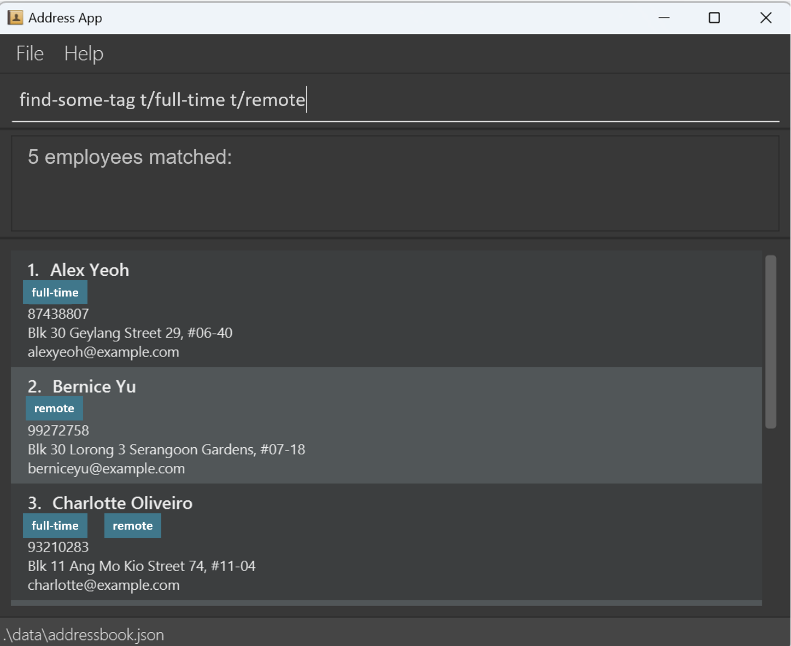

<frontmatter>
  layout: default.md
  pageNav: 3
  title: "User Guide"
</frontmatter>

# HRMate User Guide

HRMate is a **desktop app for managing employee records, optimized for use via a Command Line Interface** (CLI) while
still having the benefits of a Graphical User Interface (GUI). If you can type fast, HRMate can get your contact management
tasks done faster than traditional GUI apps.

<!-- * Table of Contents -->
<page-nav-print></page-nav-print>

--------------------------------------------------------------------------------------------------------------------

## Quick start

1. Ensure you have Java `11` or above installed in your Computer.

2. Download the latest `hrmate.jar` from [to be updated]().

3. Copy the file to the folder you want to use as the _home folder_ for your HRMate.

4. Open a command terminal, `cd` into the folder you put the jar file in, and use the `java -jar hrmate.jar` command to run the application. 
   A GUI similar to the below should appear in a few seconds. Note how the app contains some sample data. 
   

5. Type the command in the command box and press Enter to execute it. e.g. typing **`help`** and pressing Enter will open the help window. 
   Some example commands you can try:

   * `list` : Lists all contacts.
   * `add n/John Doe p/98765432 e/johnd@example.com a/John street, block 123, #01-01` : Adds a contact named `John Doe` to the Address Book.
   * `delete 3` : Deletes the 3rd contact shown in the current list.
   * `clear` : Deletes all contacts.
   * `exit` : Exits the app.

6. Refer to the [Features](#features) below for details of each command.

--------------------------------------------------------------------------------------------------------------------
## How to read each command's description

The description for each command will contain the following

### **[Action]**: [Command name]

* **What It does:**
  * A short description of what the command helps you to do
* **Format:**
  * Contained within a `code block`. It specifies how the command should be formatted. You should follow the specified
    format to ensure the command performs the desired action. Refer to [How to interpret command formats](#how-to-interpret-command-formats) for
    more details.
* **Examples:**
  * Gives a few examples of how the command is used and describes the outcome of the command
* **Acceptable Values:** 
  * Describes any restrictions on the type of values used in a command field. Values for these fields must satisfy the
    restrictions for the command to be acceptable.
* **Warning:** 
  <box type="warning" seamless>
  Describes any potential dangers of using a particular command that may lead to unexpected side effects. You should
  pay attention to the warnings to avoid performing a costly operation.
  </box>
* **Expected Output On Success:**
  * Describes what you should see if the command is accepted. Changes can be of one of two types - either through visual
    elements (stated as GUI changes) or via messages.
* **Expected Output On Failure:**
  * Describes what you should see if the command is rejected
* **For advanced users:**
  * Describes actions that users familiar with the application can use to provide greater convenience. Be careful when
    performing these actions, especially if you are a new user!

## How to interpret command formats

Example command format: `add n/NAME p/PHONE_NUMBER e/EMAIL a/ADDRESS [t/TAG]...`

This command is used to add an employee to the address book. Let's examine how we can use this command.

| **Command component examples** | **What they mean**                                                                                                                                                                                                                                                                                                                                                                                                                                               |
|--------------------------------|------------------------------------------------------------------------------------------------------------------------------------------------------------------------------------------------------------------------------------------------------------------------------------------------------------------------------------------------------------------------------------------------------------------------------------------------------------------|
| add                            | The name of the command. It is the first word of the command. You must specify the command that you intend to use.                                                                                                                                                                                                                                                                                                                                               |
| n/NAME                         | Command fields. We use these fields to supply further information that the command requires, in this case, the employee's name. Fields are separated by a space. Some fields require a field prefix, while other fields do not have a field prefix. Let's look at the field in greater detail.                                                                                                                                                                   |
| n/                             | Field prefix. It contains a letter followed by a forward slash (/). If the field has a field prefix, the prefix must be specified at the start of the field. Each of these fields has a unique prefix, which can be found by referring to the command format (e.g. n/ for the name field, p/ for the phone number field). Additionally, fields with field prefixes can be written in any order, so long as they are written after fields without field prefixes. |
| NAME                           | Field name. For field names that contain more than one word, they are separated by an underscore, e.g. PHONE_NUMBER. We can replace this with information specific to our scenario. For instance, if we add an employee named *John Smith*, we will type in the field as `n/John Smith`, where *John Smith* replaces NAME.                                                                                                                                       |
| [t/TAG]                        | Optional command fields. Fields wrapped in square brackets i.e. [] are optional and need not be filled in for the command to succeed. Nevertheless, if you want to supply this field to the command, follow the format specified within the square brackets. For instance, if we want to provide a tag (e.g. *manager*) an optional field, we will key in the field as `t/manager`.                                                                              |
| ...                            | The ellipsis following a field indicates that we can supply any number of that particular field, with each field separated by a space. In the example, [t/TAG]... means we can provide any number of tags in the command. For instance, if we want to provide the tags *manager* and *sales*, we can key them in as `t/manager t/sales`.                                                                                                                         |
**Notes**
* Parameters can be in any order  
  e.g. if the command specifies `n/NAME p/PHONE_NUMBER`, `p/PHONE_NUMBER n/NAME` is also
  acceptable.
* Extraneous parameters for commands that do not take in parameters (such as `help`, `list`, `exit` and `clear`) will be
  ignored   
  e.g. if the command specifies `help 123`, it will be interpreted as `help`.
* If you are using a PDF version of this document, be careful when copying and pasting commands that span multiple lines
  as space characters surrounding line-breaks may be omitted when copied over to the application.
--------------------------------------------------------------------------------------------------------------------
## Features
### Viewing help : `help`

* **What It Does:**
  * Shows a message explaining how to access the help page.
* **Format:**
  * `help`
* **Examples:**

| S/N | Command information                                                                              |
|-----|--------------------------------------------------------------------------------------------------|
| 1   | **Command:** `help`    **Output:** Displays a message showing how to access the help page. |
* **Acceptable Values:**
  * This command does not have any parameters
* **Expected Output on Success:**
  * GUI Changes: A message appears showing how to access the help page

* **Expected Output on Failure:**
  * Error messages: N/A (no expected failure)

### Adding a new employee or adding employees to set up HRMate initially: `add`

* **What It Does:**
  * Uses employee fields from the command to add an employee
* **Format:**
  * `add n/NAME p/PHONE_NUMBER e/EMAIL_ADDRESS a/HOME_ADDRESS [t/TAG]...`
* **Examples:**

| S/N | Command information                                                                                                                                                                                                                                                                                                                                                                                                                            |
|-----|------------------------------------------------------------------------------------------------------------------------------------------------------------------------------------------------------------------------------------------------------------------------------------------------------------------------------------------------------------------------------------------------------------------------------------------------|
| 1   | **Command:** `add n/John Doe p/98765432 e/johnd@example.com a/John Street, block 123 #01-01`    **Output:** Adds an employee with the following details into the address book: <ul><li>Name: John Doe</li> <li>Phone number: 98765432</li> <li>Email address: johnd@example.com</li> <li>Home address: John Street, block 123 #01-01</li></ul>                                                                                           |
| 2   | **Command:** `add n/Betsy Crowe e/betsycrowe@example.com a/Newgate Prison p/91234567 t/criminal t/friend`    **Output:** Adds an employee with the following details into the address book: <ul><li>Name: Betsy Crowe</li> <li>Phone number: 91234567</li> <li>Email address: betsycrowe@example.com</li> <li>Home address: Newgate Prison</li> <li>Tags: criminal, friend (Note: we can add multiple tags to the same record)</li></ul> |
* **Acceptable Values:**
  * A non-empty input for name, phone number, email address, home address and each optional tag
* **Expected Output on Success:**
  * GUI Changes: the created user is shown in a dedicated interface section
  * Message shown to user: "Successfully created employee"
* **Expected Output on Failure:**
  * `Missing argument error` -  if a compulsory argument is missing (compulsory arguments are `NAME`, `EMAIL`, 
    `PHONE_NUMBER` and `HOME_ADDRESS`)
  * `FIELD must be of format...` - if at least one of the field inputs violates the field's format requirements. Follow
    the displayed error message to fix the format error.
* **For advanced users:**
  * `add` takes in any number of tags, as an employee can have any number of tags

### Listing all employees: `list`

* **What It Does:**
  * Shows a list of all employees in HRMate
* **Format:**
  * `list`
* **Examples:** 

| S/N | Command information                                                                        |
|-----|--------------------------------------------------------------------------------------------|
| 1   | **Command:** `list`    **Output:** Shows a list of all employees in the address book |
* **Acceptable Values:**
  * This command has no parameters
* **Expected Output on Success:**
  * GUI Changes: A list of employees is displayed in a dedicated interface section
* **Expected Output on Failure:**
  * N/A (no expected failure)

### Editing an employee's personal information: `edit`

* **What It Does:**
  * Edits an existing person in HRMate based on their index on the [list](#listing-all-employees-list) command
* **Format:**
  * `edit INDEX [n/NAME] [p/PHONE_NUMBER] [e/EMAIL_ADDRESS] [a/HOME_ADDRESS] [t/TAG]...`
* **Examples:**

| S/N | Command information                                                                                                                                                                                                                                         |
|-----|-------------------------------------------------------------------------------------------------------------------------------------------------------------------------------------------------------------------------------------------------------------|
| 1   | **Command:** `edit 1 p/91234567 e/johndoe@example.com`    **Output:** Edits the employee with index 1 to have the below changes: <ul><li>Phone number: 91234567</li> <li>Email: johndoe@example.com</li> <li>No changes to the other fields</li></ul> |
| 2   | **Command:** `edit 2 n/Betsy Crower t/`    **Output:** Edits the employee with index 2 to have the below changes: <ul><li>Name: Betsy Crower</li> <li>Tags: (all removed)</li> <li>No changes to the other fields</li></ul>                           |
| 3   | **Command:** `edit 3 t/friend`    **Output:** Edits the employee with index 3 to have the below changes: <ul><li>Tags: friend (all other existing tags removed)</li> <li>No changes to the other fields</li></ul>                                     |
* **Acceptable Values:**
  * The specified `INDEX` must match with an employee shown in the displayed person list
  * At least one employee field must be changes (`edit 1` would be invalid as no employee fields are changed)
  * Only fields specified will be modified; fields not specified in the command will not be modified. A field is
    specified by including its associated field prefix in the command (i.e. `n/` for name, `p/` for phone number etc.)
  * For the name, phone number, email address and home address fields: If these fields are included in the command, they
    cannot be left empty (e.g. `n/` is not allowed as the new name cannot be empty)
* **Warning:**
    <box type="warning" seamless>
    If the tag prefix is specified, all existing tags currently associated with the employee will be removed and
    replaced with the new tags specified in the command, if any (see examples 2 and 3 above). Therefore, to avoid losing
    any tags associated with the employee, we recommend using the [add-tag](#adding-tags-to-employees-add-tag) and [delete-tag](#removing-tags-from-employees-delete-tag) commands instead for
    greater control.
    </box>
* **Expected output on failure:**
  * `At least one field to edit must be provided` - if no fields are provided
  * `The person index provided is invalid` - if the index provided does not match with any employee in the displayed
    person list
  * `FIELD must be of format...` - if at least one of the field inputs violates the field's format requirements. Follow
    the displayed error message to fix the format error.
* **For advanced users:**
  * You can remove all the tags of an employee with `edit INDEX t/` (see example 2 above)

### Viewing All Tags: `view-tag`

* **What It Does:**
  * Shows a list of all tags currently in use within the address book, which helps HR managers quickly identify different categories of employees.
    
* **Format:**
  * `view-tag`
* **Examples:**

| S/N | Command information                                                                                                         |
|-----|-----------------------------------------------------------------------------------------------------------------------------|
| 1   | **Command:** `view-tag`    **Output:** Shows a list of all tags assigned to at least one employee in the address book |

* **Acceptable Values:**
  * This command doesn't require any parameters.
* **Expected Output on Success:**
  * GUI Changes: A list of tags is displayed in a dedicated interface section.
  * Message shown to the user: "Successfully fetched all tags."
* **Expected Output on Failure:**
  * Error messages: N/A (since no parameters are involved, the command will not fail due to invalid input)

### Adding tags to employees: `add-tag`

* **What It Does:**
  * Adds a tag to an employee record, useful for classifying employees like 'remote', 'contract', etc.

* **Format:**
  * `add-tag EMPLOYEE_LIST_INDEX TAG`
* **Examples:**

| S/N | Command information                                                                                                                                                                                                                        |
|-----|--------------------------------------------------------------------------------------------------------------------------------------------------------------------------------------------------------------------------------------------|
| 1   | **Command:** `add-tag 3 remote`    **Output:** Adds the tag “remote” to the employee whose index is 3. For instance, if “Paolo Maldini” is the employee whose index is 3, Maldini’s record will now contain the tag “remote”.        |
| 2   | **Command:** `add-tag 14 contract`    **Output:** Adds the tag “contract” to the employee whose index is 14. For instance, if “Thierry Henry” is the employee whose index is 14, Henry’s record will now contain the tag “contract”  |

* **Acceptable Values:**
  * Employee List Index: A unique identifier corresponding to a row entry shown in the address book. It must be a valid number and cannot exceed the number of entries in the address book.
  * Tag: A non-empty string used to categorise and label an employee. Tags must be single words and contain only alphanumeric characters (e.g., remote, contract, full-time). They are also case-sensitive, so “friend” and “Friend” are different tags.
* **Expected Output on Success:**
  * GUI Changes: The employee's record shows the new tag.
  * Message shown to the user: "Tag [Tag] added to [Employee name]."
* **Expected Output on Failure:**
  * `Employee list index does not exist.` - An invalid index was specified
  * `Tag already exists on this employee.` - The specified tag already exists in the employee's record
  * `Missing employee list index or tag.` - There were missing parameters in command

### Removing tags from employees: `delete-tag`

* **What It Does:**
  * Removes a tag from an employee record. This is used when an employee's category changes or the tag no longer applies.

* **Format:**
  * `delete-tag EMPLOYEE_LIST_INDEX TAG`
* **Examples:**

| S/N | Command information                                                                                                                                                                                                                                        |
|-----|------------------------------------------------------------------------------------------------------------------------------------------------------------------------------------------------------------------------------------------------------------|
| 1   | **Command:** `delete-tag 5 t/remote`    **Output:** Removes the tag “remote” from the employee whose index is 5. For instance, if “Rio Ferdinand” is the employee whose index is 5, the tag “remote” will be removed from Ferdinand’s record.          |
| 2   | **Command:** `delete-tag 7 t/contract t/temp`    **Output:** Removes the tag “contract” and "temp" from the employee whose index is 7. For instance, if “Cristiano Ronaldo” is the employee whose index is 7, the tag “contract” and "temp" will be removed from Ronaldo’s record.  |

* **Acceptable Values:**
  * Employee List Index: A unique identifier corresponding to a row entry shown in the address book. It must be a valid number and cannot exceed the number of entries in the address book.
  * Tag: A non-empty string used to categorise and label an employee. Tags must be single words and contain only alphanumeric characters (e.g., remote, contract, full-time). They are also case-sensitive, so “friend” and “Friend” are different tags.
* **Expected Output on Success:**
  * GUI Changes: The employee's record is updated to remove the deleted tag.
  * Message shown to the user: "Tag [Tag] removed from [Employee name]."
* **Expected Output on Failure:**
  * `The employee index provided is invalid` - An invalid index was specified
  * `Some of the tags are not found on this employee.` - The specified tag does not exist in the employee's record
  * `Invalid command format!...` followed by command information - There were missing parameters in command

### Finding employees with all tags in a group of tags: `find-all-tag`

* **What It Does:**
  * Filters and displays individuals from a dataset who match all the specified tags exactly. It helps users narrow their search to find records meeting all the specified criteria.
    
* **Format:**
  * `find-all-tag [t/TAG]...`
* **Examples:**

| S/N | Command information                                                                                                                       |
|-----|-------------------------------------------------------------------------------------------------------------------------------------------|
| 1   | **Command:** `find-all-tag t/remote t/full-time`    **Output:** Shows a list of employees who are both full-time and work remotely  |

* **Acceptable Values:**
  * Tags: Any predefined tags available in the address book (e.g. remote, contract, full-time)
  * Only full words will be matched, e.g. “remote” will not match “remotely”
* **Expected Output on Success:**
  * GUI Changes: A list of employees who match some of the specified tags will be shown in a dedicated interface section
  * Message shown to the user: "[Number of matched employees] employees matched: "
* **Expected Output on Failure:**
  * `Tags do not exist` - Invalid tags
  * `Missing tags` - Missing parameters
  
### Finding employees with at least one tag in a group of tags: `find-some-tag`

* **What It Does:**
  * Filters and displays individuals from a dataset who match at least one of the specified tags. It provides flexibility by showing records that meet any of the criteria provided.

* **Format:**
  * `find-some-tag [t/TAG]...`
* **Examples:**

| S/N | Command information                                                                                                                                                                |
|-----|------------------------------------------------------------------------------------------------------------------------------------------------------------------------------------|
| 1   | **Command:** `tag find-one-tag t/full-time t/remote `    **Output:** Shows a list of employees who either full-time or work remotely or both full-time and working remotely  |

* **Acceptable Values:**
  * Tags: Any predefined tags available in the address book (e.g. remote, contract, full-time)
  * Only full words will be matched, e.g. “remote” will not match “remotely”
* **Expected Output on Success:**
  * GUI Changes: A list of employees who match some of the specified tags will be shown in a dedicated interface section
  * Message shown to the user: "[Number of matched employees] employees matched: "
* **Expected Output on Failure:**
  * `Tags do not exist` - Invalid tags
  * `Missing tags` - Missing parameters
* **For advanced users:**
  * GUI Changes: The displayed employees will be sorted in the order of the search terms, from one match to all matches.
    
### Locating an employee in HRMate by name: `find`

* **What It Does:**
  * Finds all employees whose name contains at least one word in the search query (case-insensitive). Only name
    containing the whole word are matched.
* **Format:**
  * `find SEARCH_QUERY...`
* **Examples:**

| S/N | Command information                                                                                                                                                                                                                  |
|-----|--------------------------------------------------------------------------------------------------------------------------------------------------------------------------------------------------------------------------------------|
| 1   | **Command:** `find martinez`    **Output:** Returns a list of employees whose names contain "*martinez*" e.g. "*Emiliano <u>Martinez</u>*" and "*Lisandro <u>Martinez</u>*"                                                    |
| 2   | **Command:** `find harry redknapp`    **Output:** Returns a list of employees whose names contain either "*harry*" or "*redknapp*" e.g. "*<u>Harry</u> Kane*", "*Jamie <u>Redknapp</u>*", and "*<u>Harry</u> <u>Redknapp</u>*" |
| 3   | **Command:** `find martin`    **Output:** Returns a list of employees whose names contain "*martin*" e.g. "*<u>Martin</u> Odegaard*" but not "*Gabriel Martinelli*" (only full word matches are displayed)                     |
* **Acceptable Values:**
  * Search query: A non-empty input is required. Inputs can contain one or more words.
* **Expected Output on Success:**
  * GUI Changes: A list of employees whose names contain at least one of the words
  * Message shown to user: "[Number of matches] employees matched:"
* **Expected Output on Failure:**
  * `Invalid Command Format` - if an empty input is provided
* **For advanced users:**
  * Employees are displayed in the order in which they are arranged in the address book

### Removing an employee Record : `delete`

* **What It Does:**
  * Removes an existing employee from HRMate, so that the employee’s record is no longer available in HRMate.
* **Format:**
  * `delete EMPLOYEE_LIST_INDEX`
* **Examples:**

| S/N | Command information                                                                                                                                                                                                                         |
|-----|---------------------------------------------------------------------------------------------------------------------------------------------------------------------------------------------------------------------------------------------|
| 1   | **Command:** `delete 1`    **Output:** Deletes the record belonging to the employee whose index is 1. For instance, if the record belongs to “*David de Gea*”, then *de Gea*’s record is removed from HRMate and no longer available. |
| 2   | **Command:** `delete 5`    **Output:**: Deletes the record belonging to the employee whose index is 5. For instance, if the record belongs to “*Carlos Puyol*”, then *Puyol*’s record is removed from HRMate and no longer available. |
* **Acceptable Values:**
  * The specified `EMPLOYEE_LIST_INDEX` must correspond to an index number shown in the address book. It must be a valid number, larger than zero, and cannot exceed the number of entries in the address book.
* **Expected Output on Success:**
  * GUI Changes: The record of the employee whose index is specified will no longer appear in the list of employees 
  * Message shown to user: "[Employee name]'s record deleted"
* **Expected Output on Failure:**
  * `Employee List Index does not exist` - An invalid index was specified
  * `Employee List Index not specified` - No index was specified by the user

### Restarting HRMate by clearing all existing records : `clear`

* **What It Does:**
  * Removes every entry from HRMate, such that the address book in HRMate is empty. A possible use case of this command
    is to remove all sample records in HRMate so that you can fill it with employee records instead.
* **Format:**
  * `clear`
* **Examples:**

| S/N | Command information                                                                          |
|-----|----------------------------------------------------------------------------------------------|
| 1   | **Command:** `clear`    **Output:** Deletes every employee record in the address book. |
* **Acceptable Values:**
  * This command does not require any parameters.
* **Warning:**
  <box type="warning" seamless>
    Be careful when using this command - the records are irretrievable once deleted.
  </box>
* **Expected Value on Success:**
  * GUI Changes: All existing records are no longer visible in the address book
  * Message shown to the user: "Address book has been cleared"
* **Expected Value on Failure:**
  * N/A (no expected failure)

### Closes the application : `exit`

* **What It Does:**
  * Closes and exits the application.
* **Format:**
  * `exit`
* **Examples:**

| S/N | Command information                                               |
|-----|-------------------------------------------------------------------|
| 1   | **Command:** `exit`    **Output:** Closes and exits HRMate. |
* **Acceptable Values:**
  * This command does not require any parameters.
* **Expected Value on Success:**
  * GUI Changes: The application window closes.
* **Expected Value on Failure:**
  * N/A (no expected failure)

### Saving the data
 
HRMate data are saved in the hard disk automatically after any command that changes the data. There is no need to save manually.

### Editing the data file

HRMate data are saved automatically as a JSON file `[JAR file location]/data/hrmate.json`. Advanced users are welcome to update data directly by editing that data file.

* **Warning:**
  <box type="warning" seamless>
    If your changes to the data file makes its format invalid, HRMate will discard all data and start with an empty data file at the next run.  Hence, it is recommended to take a backup of the file before editing it.
  </box>

### Archiving data files `[coming in v2.0]`

_Details coming soon ..._

--------------------------------------------------------------------------------------------------------------------

## FAQ

**Q**: How do I transfer my data to another Computer? 
**A**: Install the app in the other computer and overwrite the empty data file it creates with the file that contains the data of your previous HRMate home folder.

--------------------------------------------------------------------------------------------------------------------

## Known issues

1. **When using multiple screens**, if you move the application to a secondary screen, and later switch to using only the primary screen, the GUI will open off-screen. The remedy is to delete the `preferences.json` file created by the application before running the application again.

--------------------------------------------------------------------------------------------------------------------

## Command summary

| Action             | Format, Examples                                                                                                                                                          |
|--------------------|---------------------------------------------------------------------------------------------------------------------------------------------------------------------------|
| **Add**            | `add n/NAME p/PHONE_NUMBER e/EMAIL a/ADDRESS [t/TAG]…​`   e.g., `add n/James Ho p/22224444 e/jamesho@example.com a/123, Clementi Rd, 1234665 t/friend t/colleague`     |
| **Clear**          | `clear`                                                                                                                                                                   |
| **Delete**         | `delete EMPLOYEE_LIST_INDEX`  e.g., `delete 3`                                                                                                                         |
| **Exit**           | `exit`                                                                                                                                                                    |
| **Edit**           | `edit INDEX [n/NAME] [p/PHONE_NUMBER] [e/EMAIL] [a/ADDRESS] [t/TAG]…​`  e.g.,`edit 2 n/James Lee e/jameslee@example.com`                                               |
| **View tag**       | `view-tag`                                                                                                                                                                |
| **Add tag**        | `add-tag EMPLOYEE_LIST_INDEX TAG`  e.g., `add-tag 3 remote`                                                                                                            |
| **Delete tag**     | `delete-tag EMPLOYEE_LIST_INDEX TAG`  e.g., `delete-tag 3 remote`                                                                                                      |
| **Find all tags**  | `find-all-tag [t/TAG]...`  e.g.,`find-all-tag t/remote t/full-time`                                                                                                    |
| **Find some tags** | `find-some-tag [t/TAG]...`  e.g.,`find-some-tag t/remote t/full-time`                                                                                                  |
| **Find**           | `find SEARCH_QUERY...​`  e.g., `find James Jake`                                                                                                                       |
| **Help**           | `help`                                                                                                                                                                    |
| **List**           | `list`                                                                                                                                                                    |
